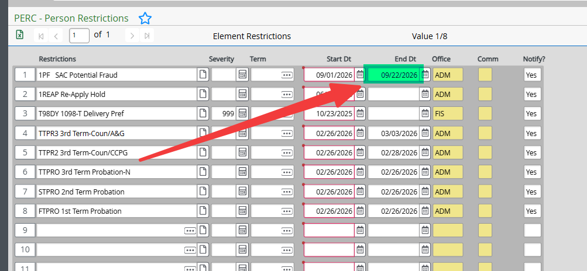
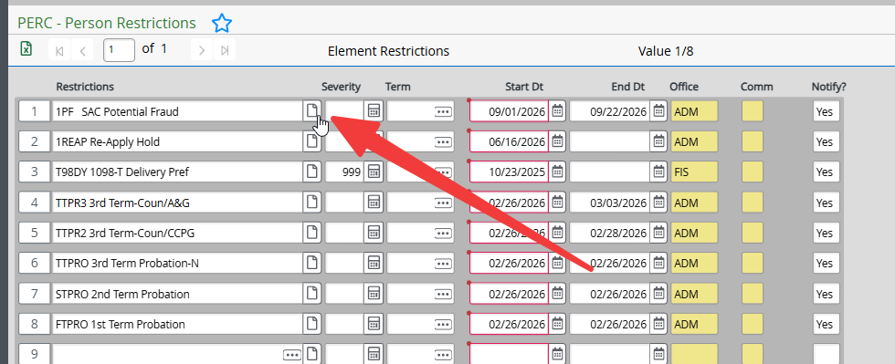
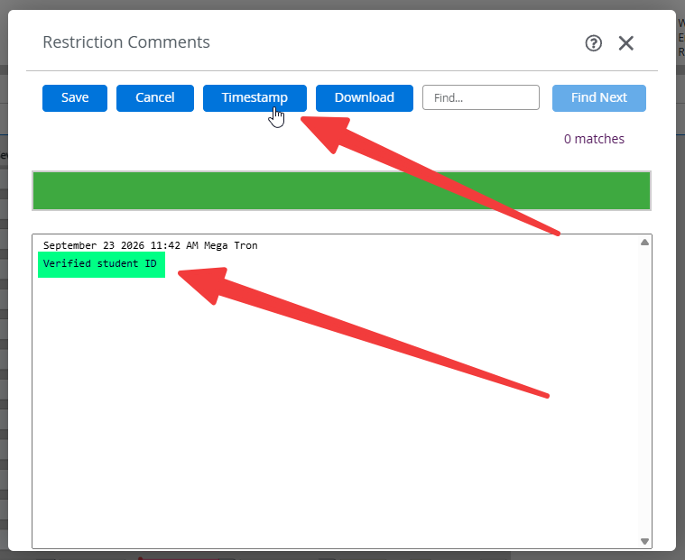

# Clearing Fraud Holds

## Overview

This procedure outlines the steps to clear fraud holds on a student's record in Colleague.
    - If student has not done so already, have them submit an [Identity Verification Form](https://federation.ngwebsolutions.com/sp/startSSO.ping?PartnerIdpId=https://sts.windows.net/a8040095-716d-4e49-b783-b5f746eea8b3/&SpSessionAuthnAdapterId=rsccdDF&TargetResource=https%3a%2f%2fdynamicforms.ngwebsolutions.com%2fSubmit%2fStart%2ffcef4290-2969-47bc-b935-3bf528655d66).
    - If the student is at the window and is still having difficulty, we can scan the physical verifying document (e.g., driver's license, passport) and upload to Laserfiche.

## Processing Steps

1. Navigate to **PERC** on Colleague.
2. Enter Student ID number.
3. Locate the fraud hold on the student's record and enter yesterday's date as the end date.

    

4. Detail into the hold.

    

5. Click Timestamp and enter comments.

    

6. Click **Save** and then click **Save All**.
