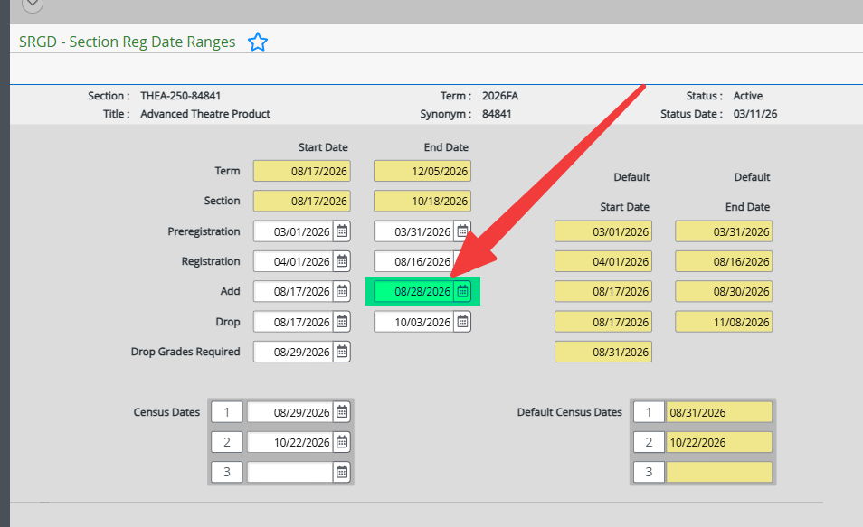
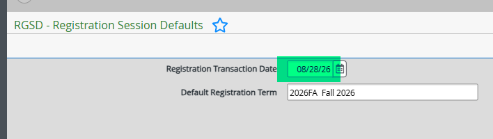
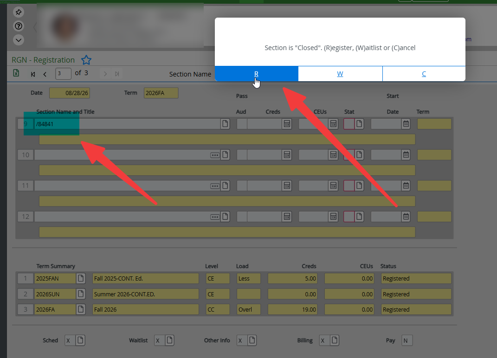
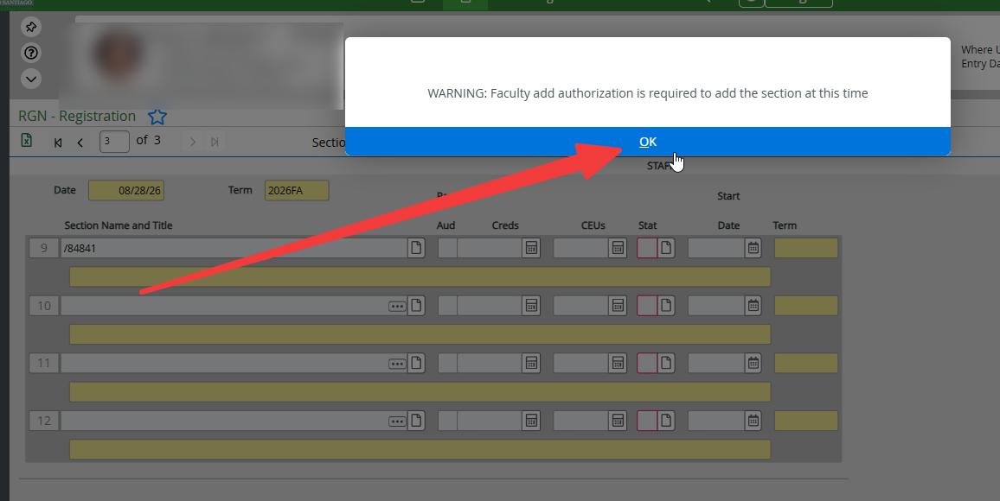
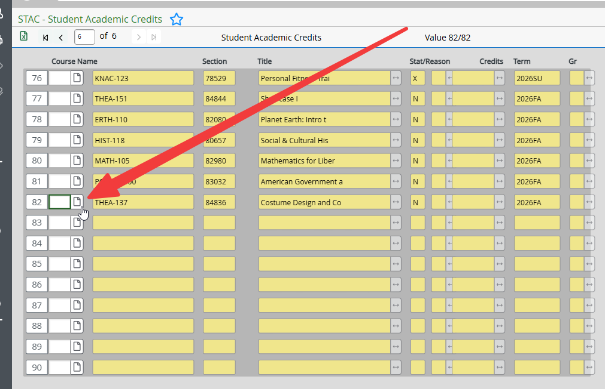
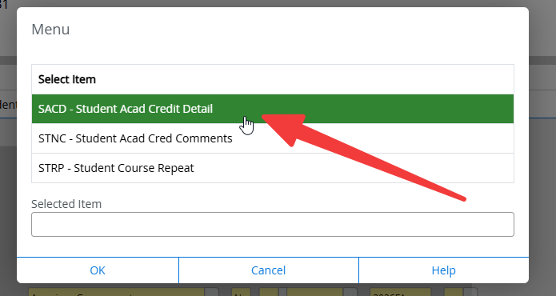
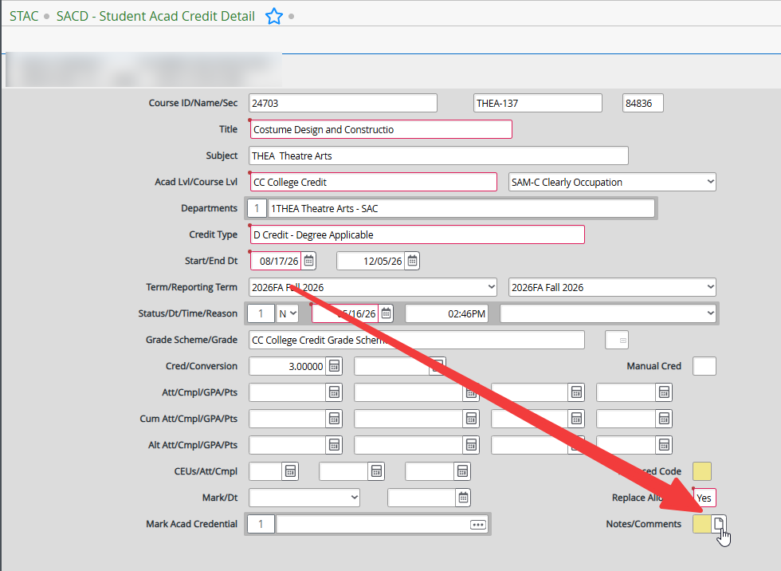
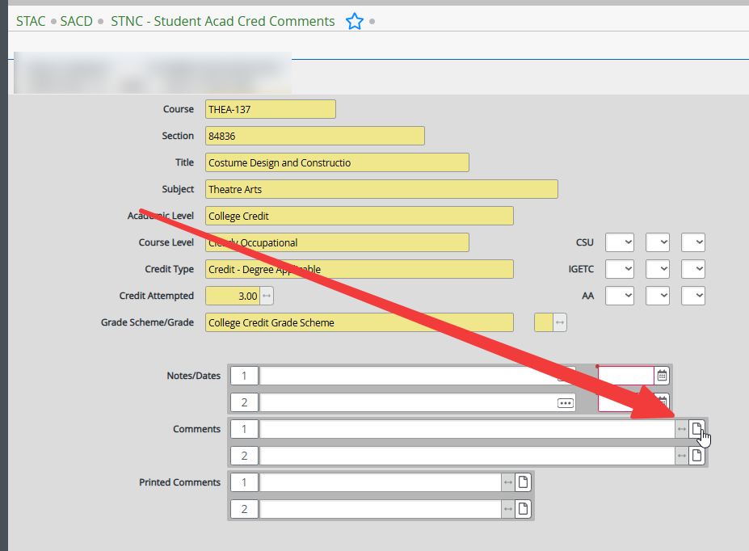
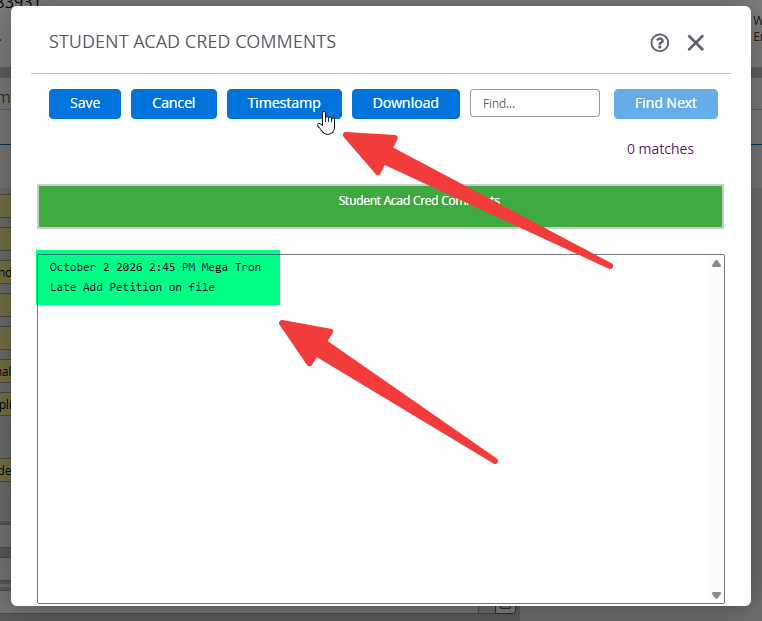

# Late Add Petitions

## Overview

Late add petitions are requests submitted by students to enroll in a course after the official add period has ended. These petitions are typically reviewed on a case-by-case basis, and approval is not guaranteed.

## Processing Steps

1. Navigate to **SRGD** on Colleague.

2. Look up the desired section by entering `//<section_number>` and pressing **Enter**.

3. Take note of the last date to add courses and then click **Cancel All**.

    

4. Navigate to **RGSD** on Colleague.

5. Update the **Registration Transaction Date** to the last date to add courses.

    

6. Navigate to **RGN** on Colleague.

7. Enter the student's ID and then the section number for the course they wish to add on a new line.

8. Press **Enter** and click **R** to register the student for the course.

    

9. Press **OK** when prompted with the "WARNING: Faculty add authorization is required to add the section at this time" pop-up message.

    

10. Click **Save All** to finalize the registration.

11. Navigate to **STAC** on Colleague.

12. Detail into the newly registered class.

    

13. Double-click on **SACD - Student Acad Credit Detail**.

    

14. Detail into **Notes/Comments**.

    

15. Detail into **Comments**.

    

16. Click Timestamp and add comments.

    

17. Click **Save** and then **Save All** to finalize the comments.