# Credit for Prior Learning

## MAP

---

## Credit By Exam

### Processing Steps

1. Enter Credit By Exam
    - Navigate to **Colleague → TSUM**.
    - Enter the Student ID number.
    - Click into an empty Admissions Test field.
    - Type in `cbe` and press **Enter**.

        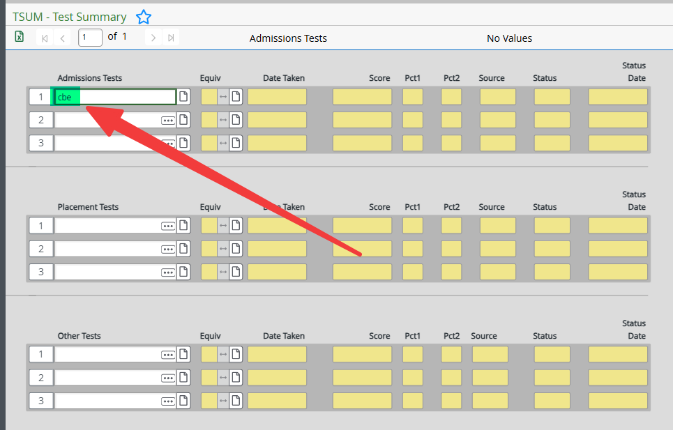

    - For Date Taken, enter the date of submission.

        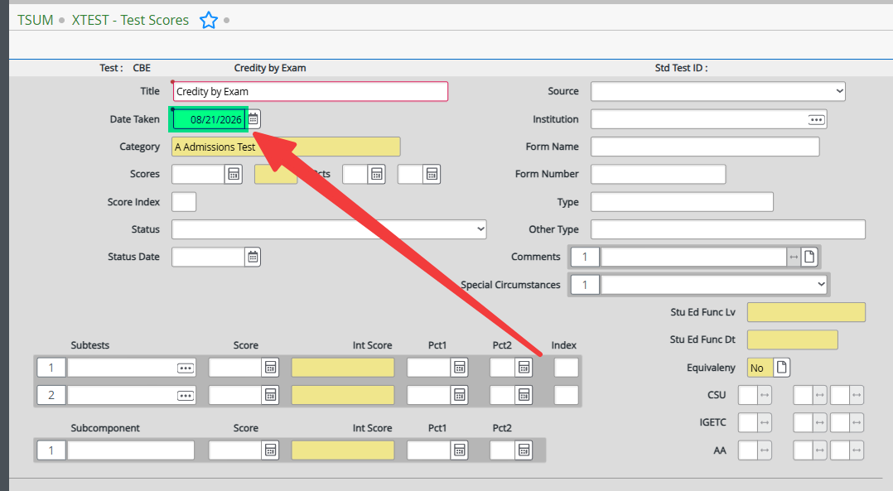

    - Click **Save**, **Update**, and **Ok**.

2. Enter Equivalency
    - Detail into **Equiv**.

        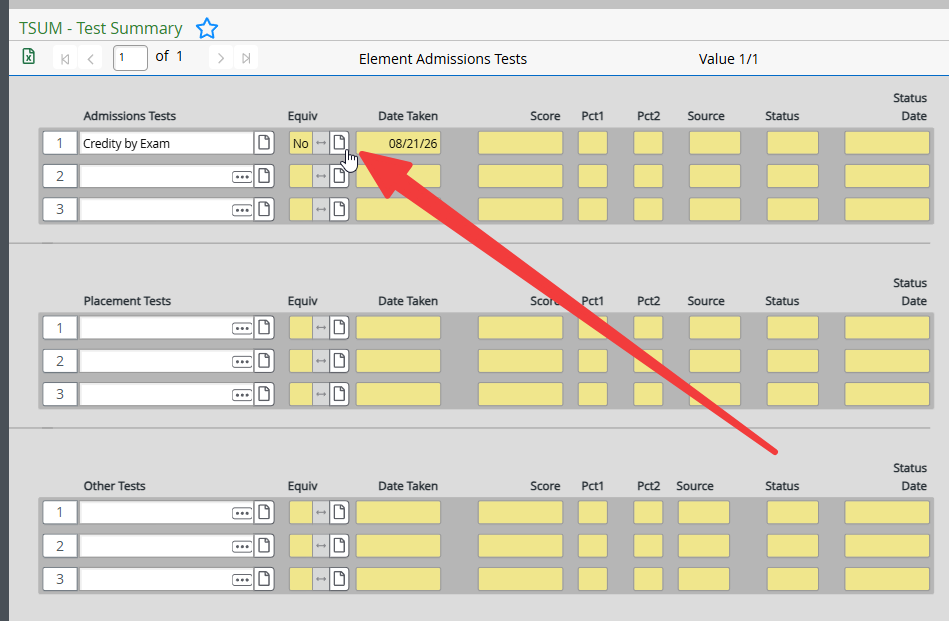

    - Detail into **Course**.

        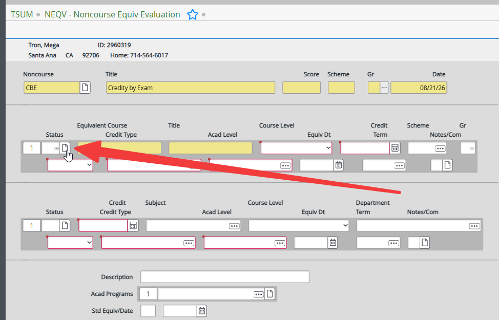

    - Type in the course code in the Course LookUp field and double-click on the course.

        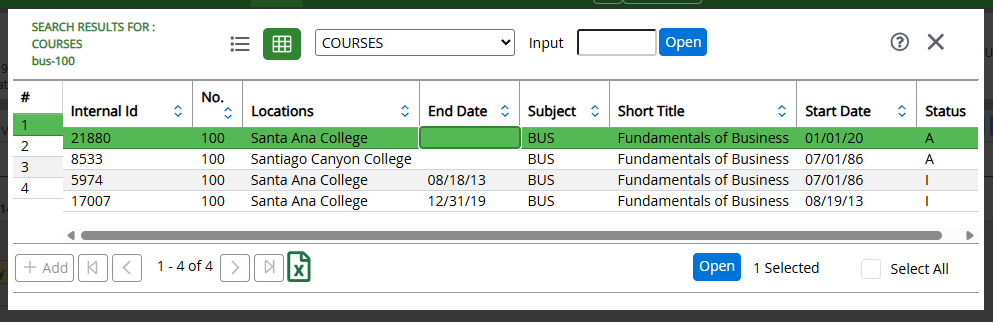

    - Fill in the following fields.

        | Field | Entry |
        |-|-|
        | Course Level | Type in `A`, `B`, `C`, `D`, or `E` |
        | Gr | Type in `P` or letter grade |
        | Status | Type in `TR` |
        | Credit Type | For College CBE Passes, type in `CBE`; For College CBE Letter Grades, type in `CBEX`; For High School CBE Passes, type in `HSCBE`; For High School CBE Letter Grades, type in `HSCBEX` |
        | Term | Type in the year and semester of the exam (e.g., `2026FA`) |

        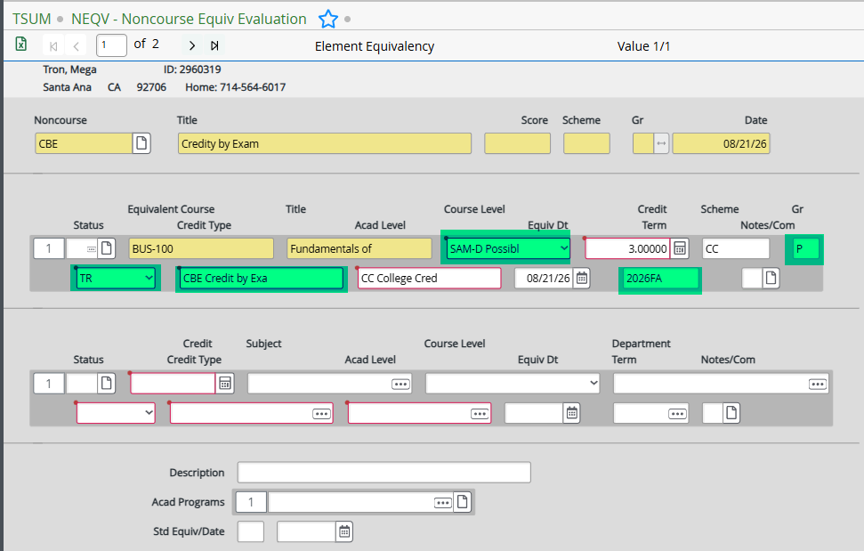

    - Click on **Notes/Comments**.

        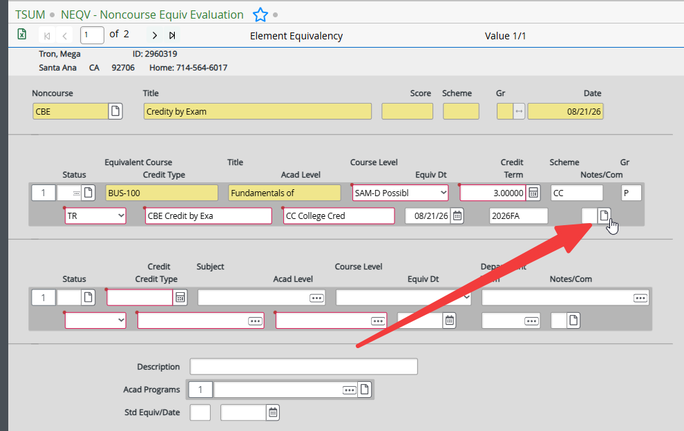

    - Fill in the following fields.

        | Field | Entry |
        |-|-|
        | Notes/Dates | Type in `PLCBE` |

        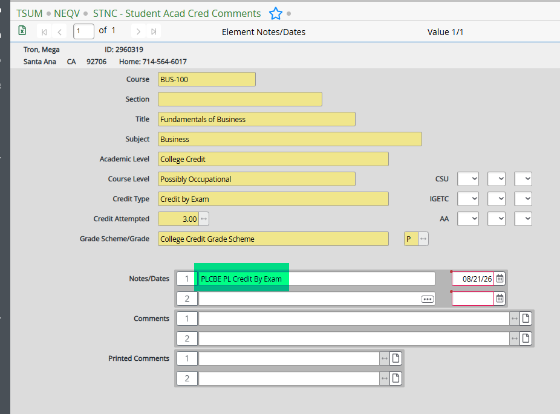

    - Click **Save All**.

---

## External Exams

### Advanced Placement (AP) Scores

!!! warning
    The student must have grades on the system first. If we add AP scores before the student has any coursework at SAC, we will be adding them with no context. If they are currently taking courses, **wait until the end of the semester**. Classes must be *SAC* courses.

---

#### Processing Steps

1. Check Student Enrollment
    - Navigate to **Colleague → STAC**.
    - Confirm the student has grades on the system before proceeding.
    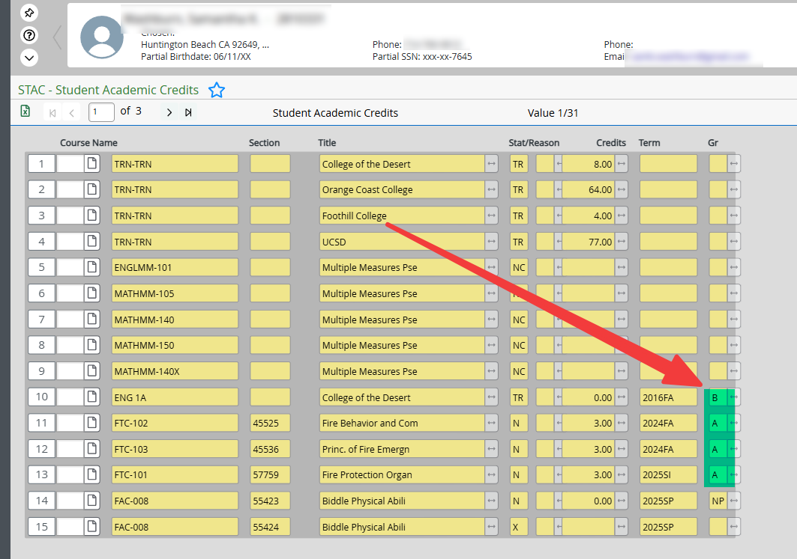

2. Enter AP Exam Information
    - Navigate to **Colleague → TSUM**.
    - Enter the **Student ID**.
    - Click into an empty Admissions Test field.
    - Enter **`ap...`**
    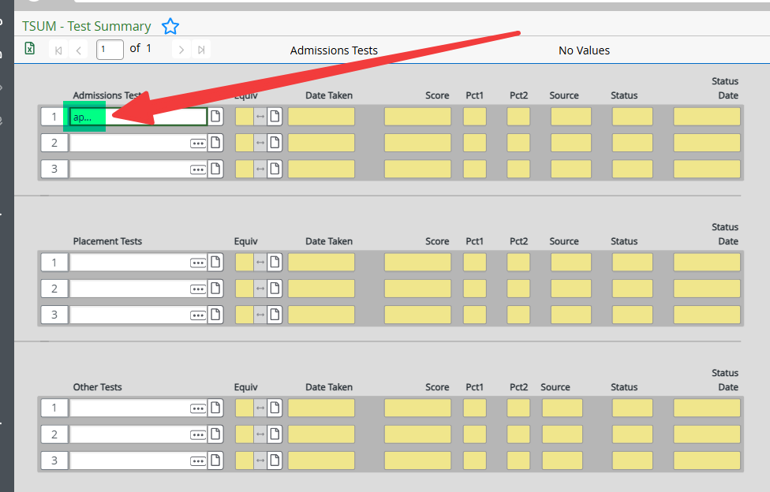
    - Double-click on the desired test.
    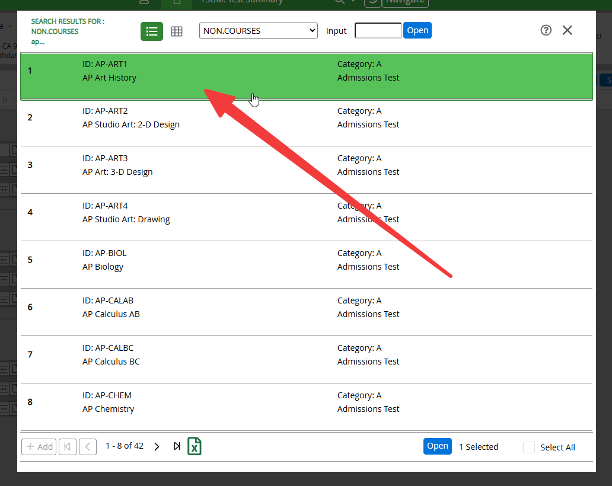

    - Enter the following information in the fields:

        | **Field** | **Instructions** |
        |-----------|------------------|
        | **Date taken** | `05/15` followed by the year the exam was taken |
        | **Scores** | Input the passing score (3–5) |
        | **CSU** | Enter codes |
        | **IGETC** | Enter codes |
        | **AA** | **Do not** enter anything for AA |

        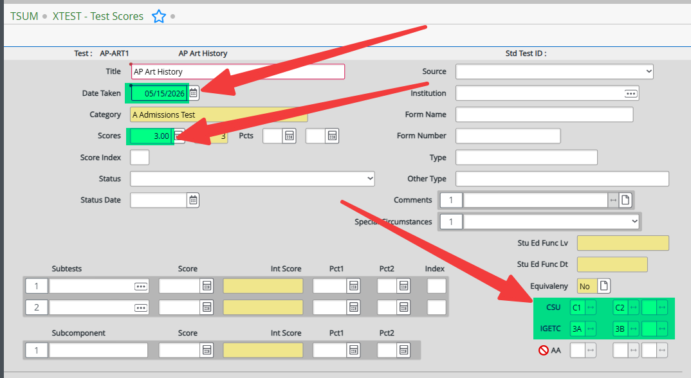

    - Click **Save All**.

3. Update Degree Audit
    - Navigate to **Colleague → EXTS**.
    - Enter the **Student ID**.
    - Select: **Advanced Placement (for Conversion)**
        - If not on the list, type **A** in input and press Enter.
        - *Institution look-up:* `1068036` or **Advanced Placement (for Conversion)**
        - Click **Save**.
        - Click **Update**.
    - Detail into the **first line**.

        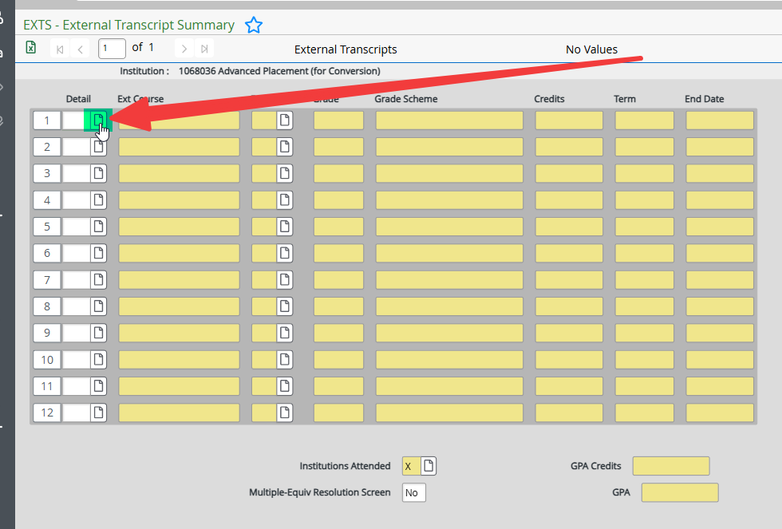

    - Enter the following information in the fields:

        | **Field** | **Instructions** |
        |-----------|------------------|
        | **External Course** | Enter AP code |
        | **End Date** | `05/15` followed by the year the exam was taken |
        | **Grade Scheme** | `CC` |
        | **Grade** | `P` |
        | **Term** | Year of exam and `SP` |

        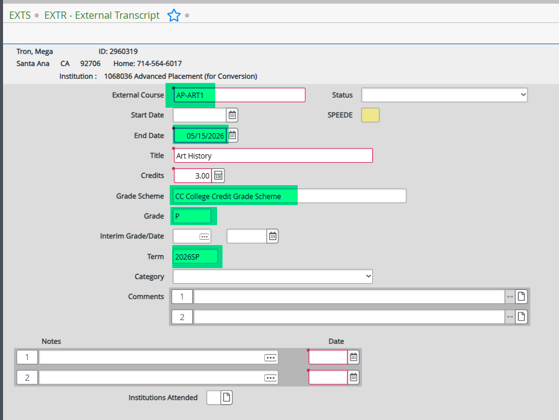

        - Click **Save** and **Update**.
        - Click **Cancel**.
    - Detail into **Equiv**.

            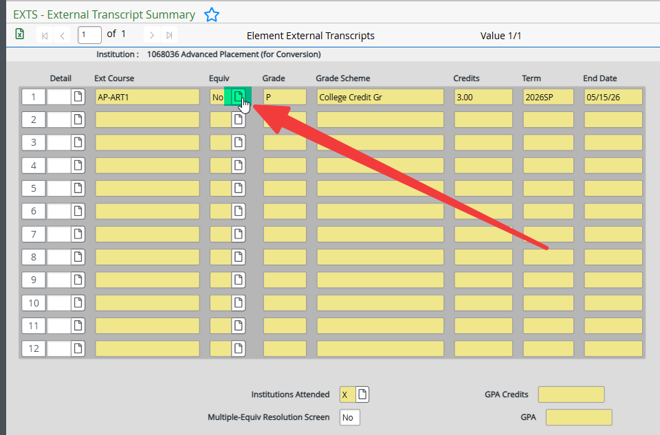

        - Click on the Equivalency line — information will populate.

            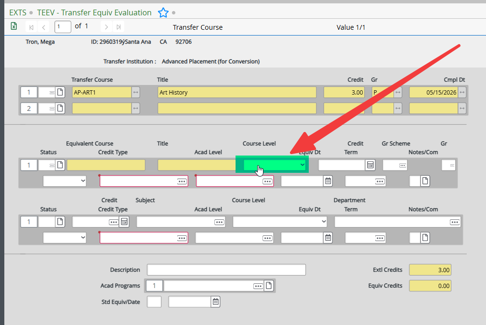
            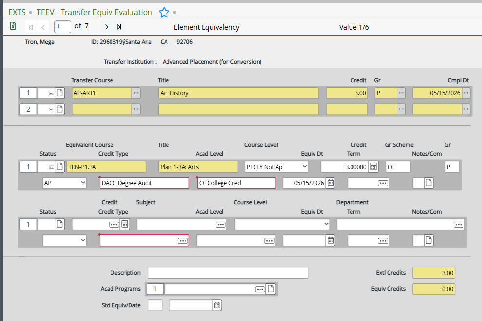

        - Click **Save All**.

4. Check Student's Transcripts
    - Navigate to **Colleague → TRAN**.
    - Check to see if AP scores are updated on the student's transcripts.

---

## Language Proficiency

### Guiding Rule

Students must have **two years of the same foreign language** with a grade of **C- or higher in the last semester**.

!!! note "Note"
    Must be the **same language** (e.g., two years of French — not one year of Spanish and one year of French).

---

### Examples

#### ✅ Meets Proficiency

| Course | Term | Grade |
|--------|------|-------|
| French I | FA17 | B |
| French I | SP18 | C |
| French 2 | FA18 | D |
| French 2 | SP19 | **C-** ← last semester must be C- or higher |

#### ❌ Does Not Meet Proficiency (last semester grade too low)

| Course | Term | Grade |
|--------|------|-------|
| French I | FA17 | B |
| French I | SP18 | C |
| French 2 | FA18 | C |
| French 2 | SP19 | **D** ← below C- |

#### ❌ Does Not Meet Proficiency (different languages)

| Course | Term | Grade |
|--------|------|-------|
| French I | FA17 | B |
| French I | SP18 | C |
| **Spanish I** | FA18 | C |
| **Spanish I** | SP19 | B |

*(Different languages — does not qualify)*

---

### Processing Steps

1. Update Degree Audit
    - Navigate to **Colleague → EXTS**.
    - Enter the Student ID number.
    - Select the student's high school by double-clicking the school.

        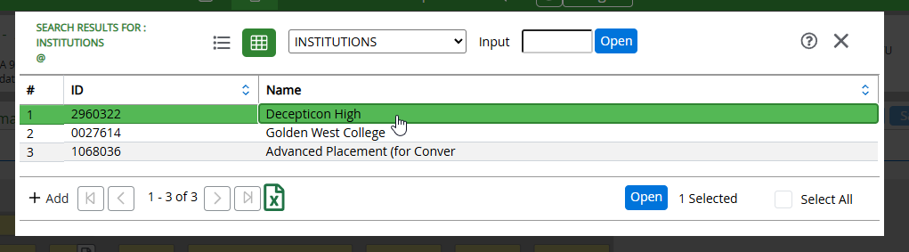

    - Detail into a new line.

        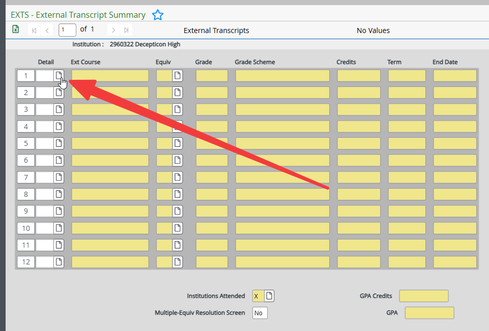

    - Fill in the following fields.

        | Field | Entry |
        |-|-|
        | External Course | Type in `LNG PROF` |
        | End Date | Type 05/31/YY (Spring), 07/31/YY (Summer), or 12/31/YY (Fall) for when the student completed the course |
        | Title | Type in `Language Proficiency` |
        | Credits | Type in `0.00` |

        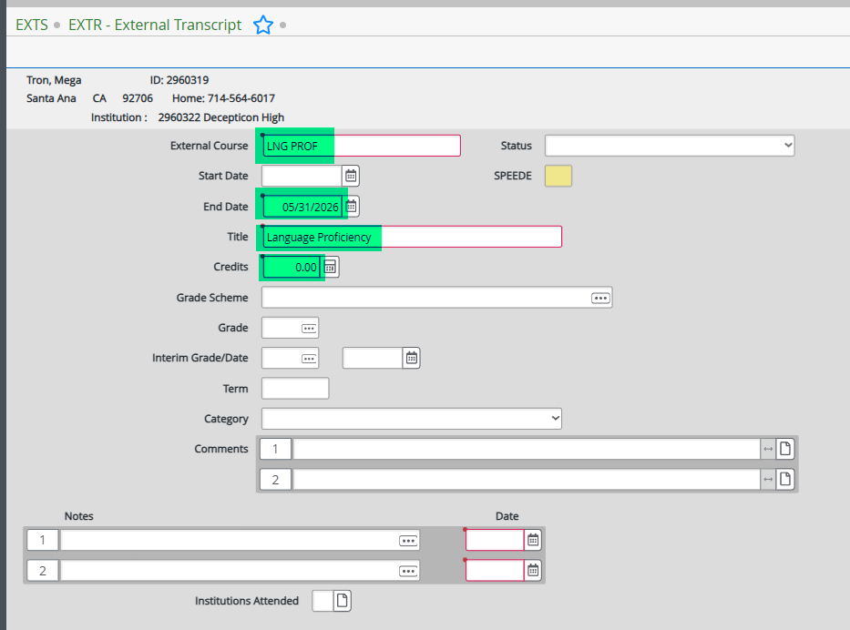

    - Click **Save** and **Update**.
    - Click **Cancel**.
    - Detail into **Equiv**.

        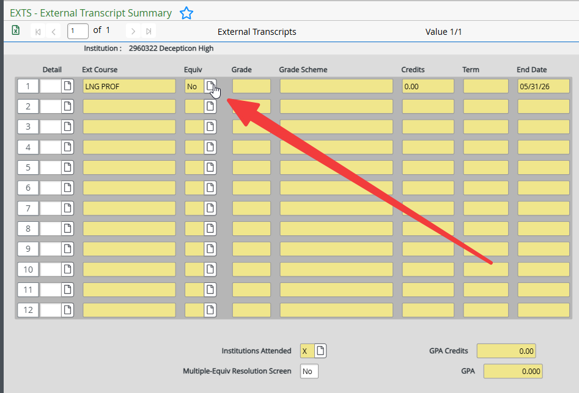

    - Detail into **Course**.

        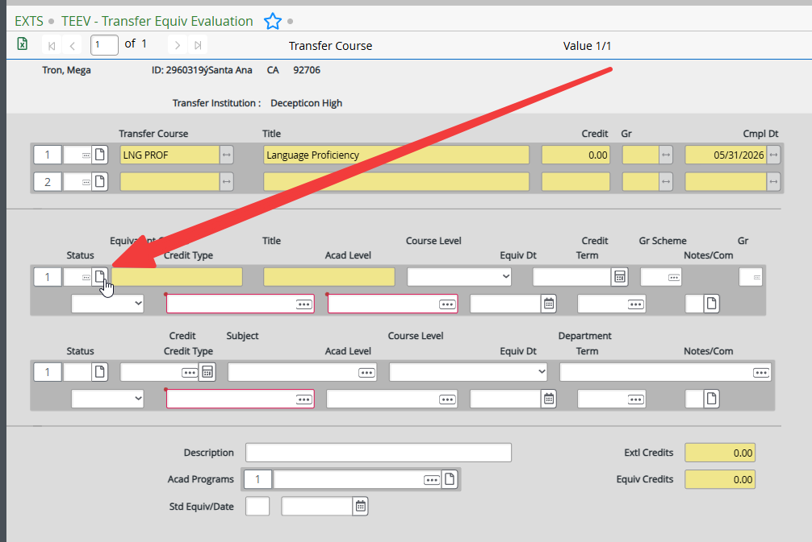

    - Type in `LNG PROF` in the Course LookUp field and double-click on `Internal ID 14116`.

        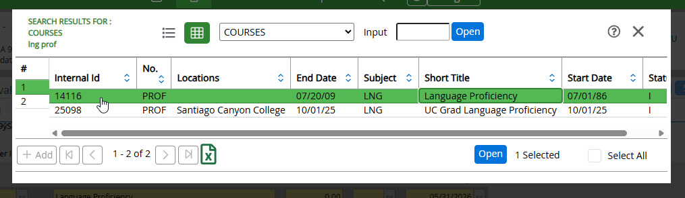

    - Fill in the following fields.

        | Field | Entry |
        |-|-|
        | Gr | Type in `P` |
        | Status | Type in `TR` |
        | Credit Type | Type in `LP` |

        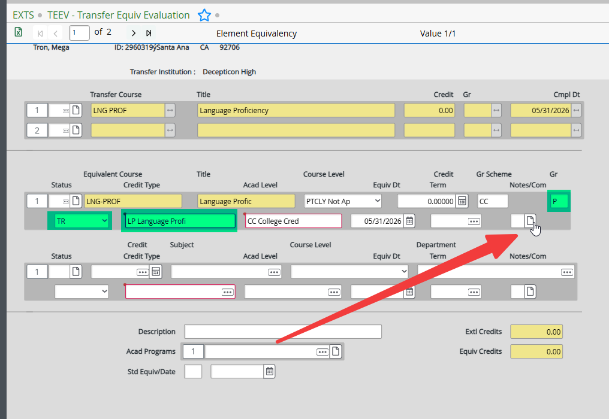

    - Click on **Notes/Comments**.
    - Type in `6` in **IGETC**.

        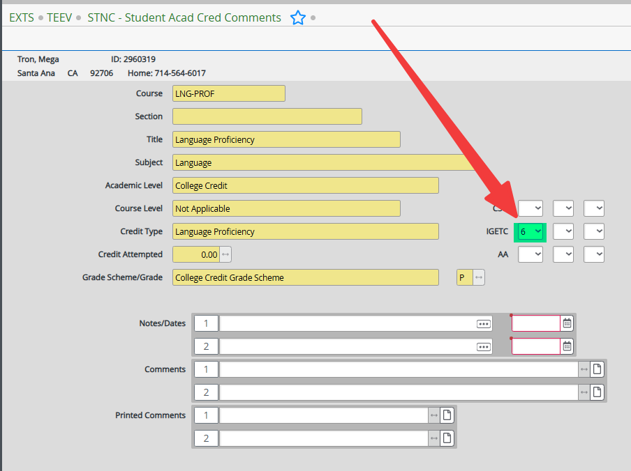

    - Click **Save All**.

    !!! warning "Check Your Work"
        After processing, verify in **TRAN** that the language proficiency appears correctly on the transcript.

## Military Service

### Processing Steps

1. Enter Military Service Credit for Health Education
    - Navigate to **Colleague → TSUM**.
    - Enter the Student ID number.
    - Click into an empty Admissions Test field.
    - Type in `mil-svc` and press **Enter**.

        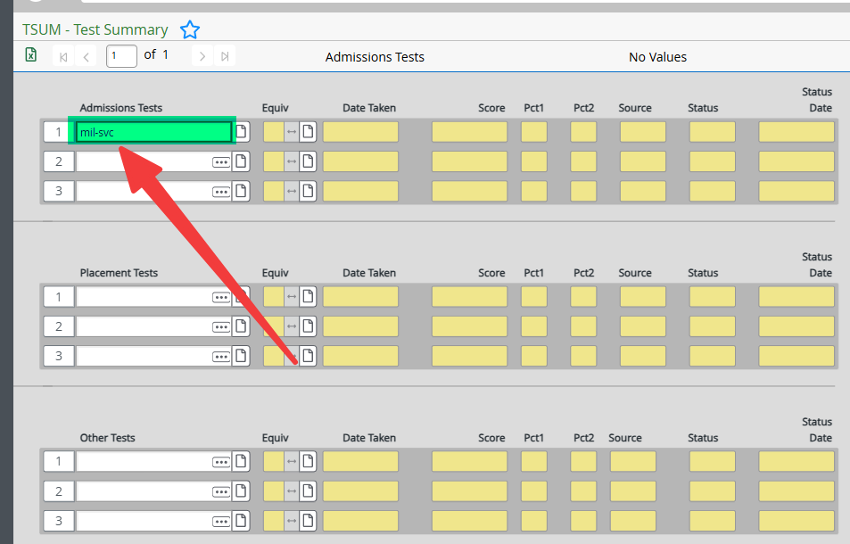

    - Click **Save**, **Update**, and **Ok**.

2. Enter Equivalency
    - Detail into **Equiv**.

        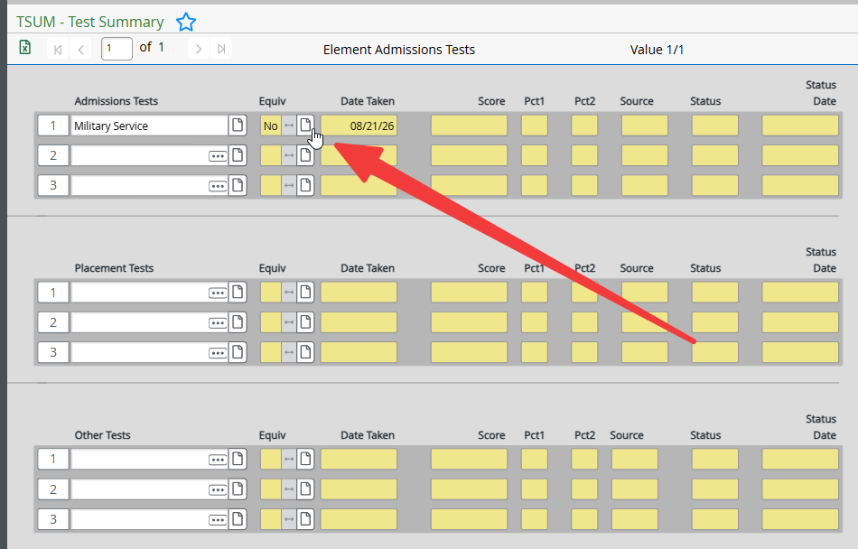

    - Detail into **Course**.

        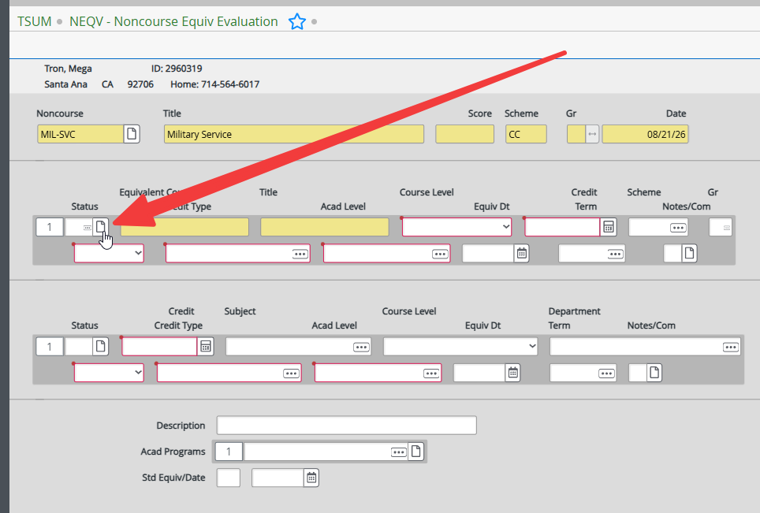

    - Type in `mil-svc1` in the Course LookUp field and double-click on the course.

        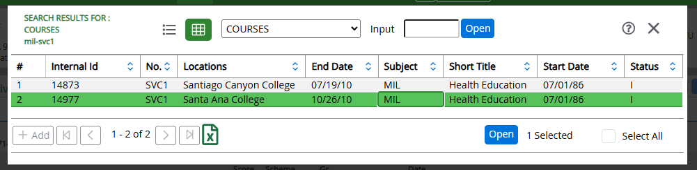

    - Fill in the following fields.

        | Field | Entry |
        |-|-|
        | Course Level | Type in `E` |
        | Credit | Type in `3.00` |
        | Gr | Type in `P` |
        | Status | Type in `TR` |
        | Credit Type | Type in `MS` |

        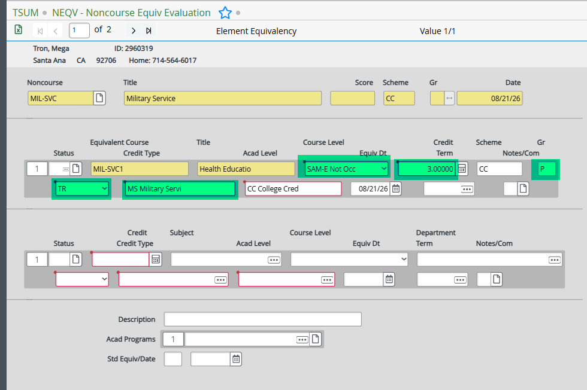

    - Click **Save** and **Update**.

3. Enter Military Service Credit for Exercise Science
    - Click into an empty Admissions Test field.
    - Type in `mil-svc` and press **Enter**.
    - Click **Save**, **Update**, and **Ok**.

4. Enter Equivalency
    - Detail into **Equiv**.
    - Detail into **Course**.

        

    - Type in `mil-svc2` in the Course LookUp field and double-click on the course.

        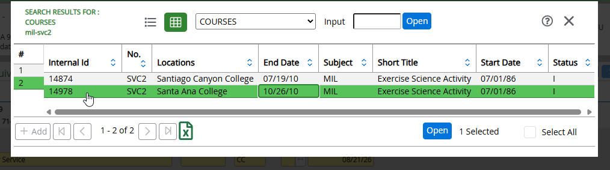

    - Fill in the following fields.

        | Field | Entry |
        |-|-|
        | Course Level | Type in `E` |
        | Credit | Type in `1.00` |
        | Gr | Type in `P` |
        | Status | Type in `TR` |
        | Credit Type | Type in `MS` |

        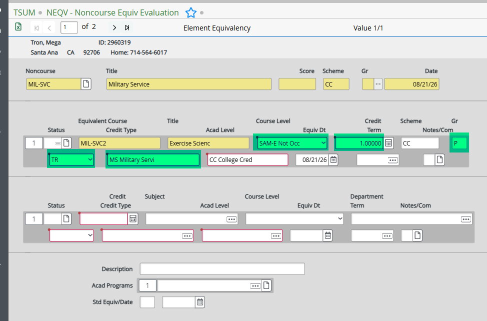

    - Click **Save All**.

---

## Prior Experience

### Processing Steps

1. Enter Prior Experience
    - Navigate to **Colleague → TSUM**.
    - Enter the Student ID number.
    - Click into an empty Admissions Test field.
    - Type in `cbe` and press **Enter**.

        

    - For Date Taken, enter the date of submission.

        

    - Click **Save**, **Update**, and **Ok**.
    
2. Enter Equivalency
    - Detail into **Equiv**.

        

    - Detail into **Course**.

        

    - Type in the course subject and number in the Course LookUp field and double-click on the **active SAC** course.

        

    - Fill in the following fields.

        | Field | Entry |
        |-|-|
        | Course Level | Type in `PTCLY` |
        | Gr | Type in `P` |
        | Status | Type in `TR` |
        | Credit Type | For Industry Experience, type in `INDX`; For Portfolio Work, type in `PX`; For Joint Services Transcripts, type in `JSTX` |

        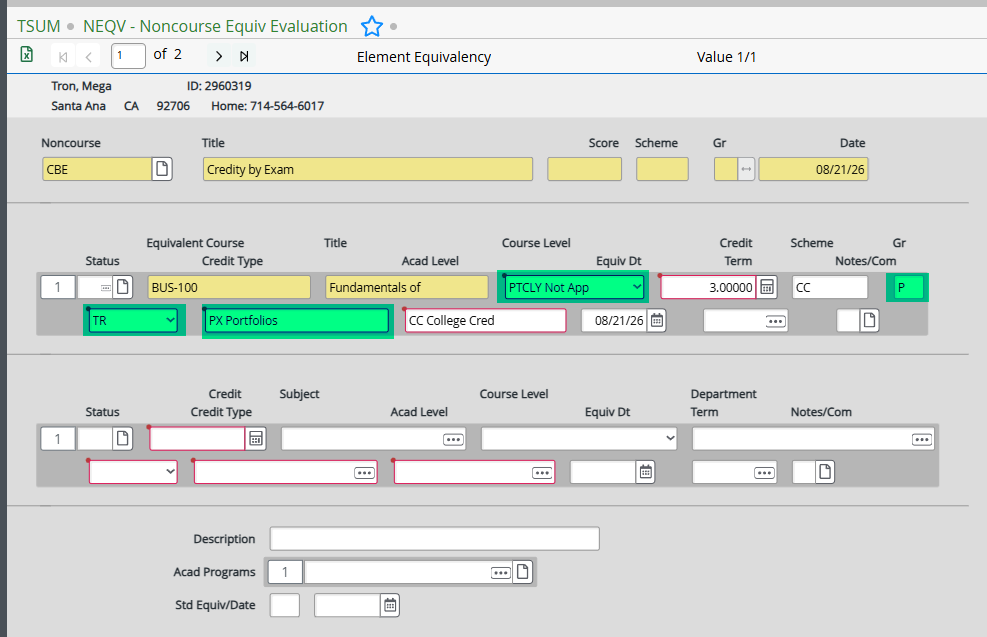

    - Click **Save All**.

---

## TSUM Steps

1. **Admissions Tests → CBE**
   - Press **Enter**.

    !!! note "Screenshot Placeholder"
        TSUM CBE entry screenshot is in the original Word manual.

2. **Date Taken**
   - Enter the **date of submission**.

3. **Save → click Update**

4. **Test LookUp → click OK**

5. **Detail into Equiv**

6. **Detail into Course**
   - **Course LookUp:** Enter and select the course.
   - **Course Level:** Try A–E until something takes.
   - **Gr:** `P`
   - **Status:** `TR`
   - **Credit Type:** Choose one from the table below.
   - **Save All**

### Credit Type Codes

| Code | Description |
|------|-------------|
| `JSTX` | Military Credit |
| `MSX` | Military Service |
| `APX` | Advanced Placement |
| `IBX` | International Baccalaureate |
| `CLEPX` | College-Level Examination Program |
| `PX` | Portfolios |
| `WEX` | Work Experience |
