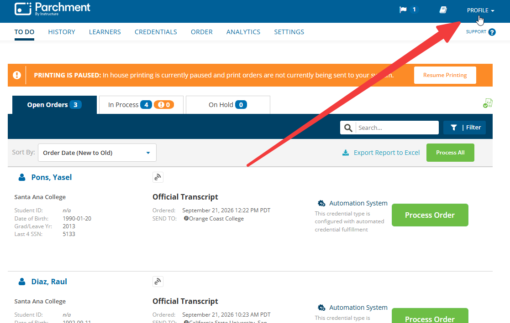
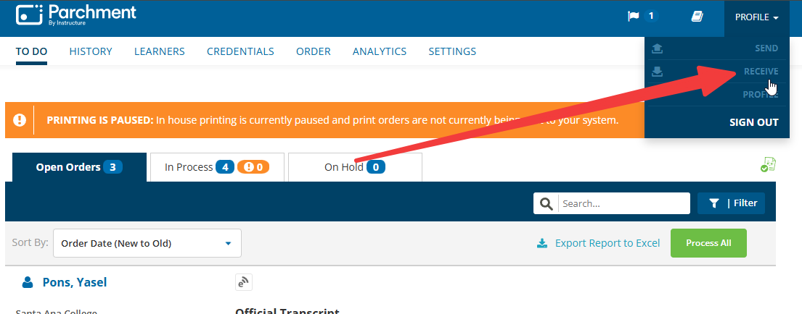
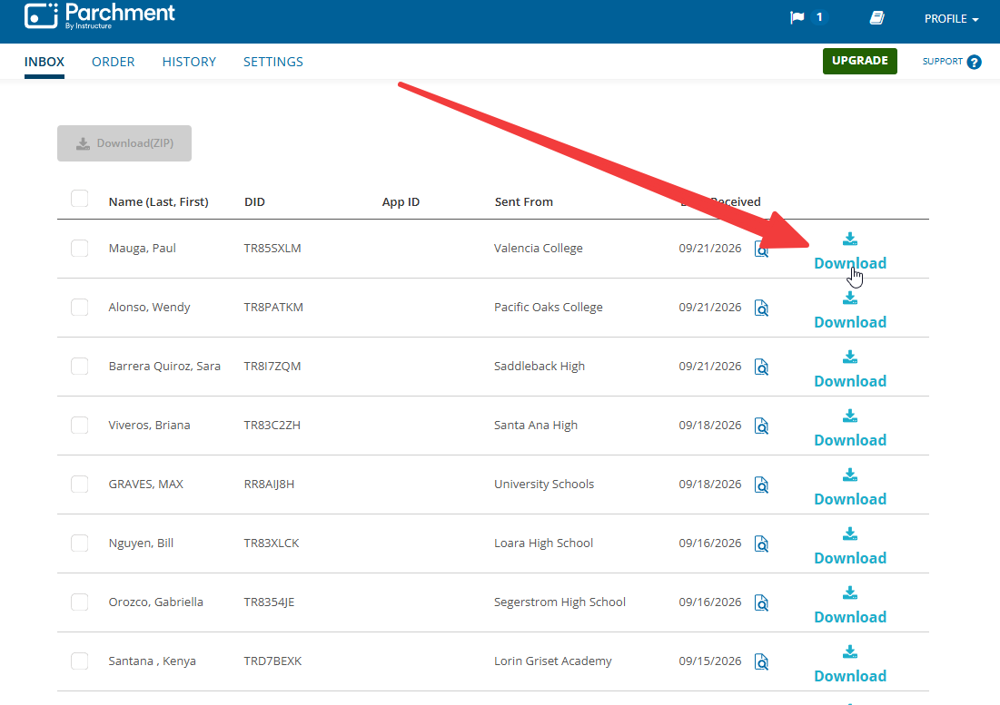

# Download Incoming Transcripts from Parchment

## Processing Steps

### Downloading Transcripts

1. Click on **PROFILE** in the top right hand corner of the Parchment interface.

    

2. Click on **RECEIVE** from the PROFILE menu.

    

3. Click **Download** to download a transcript.

    

4. Search for the student in Colleague.

5. Name each file using this format:

    ```
    Lastname, Firstname Middleinitial._STUDENTID_School Name
    ```

    If no Colleague ID is found:

    ```
    Lastname, Firstname Middleinitial._NO ID_School Name
    ```

!!! note "Multi-College Transcripts"
    - If the transcript file contains multiple colleges, save the file as the district.
    - If the transcript has multiple colleges but only one is relevant, save the file using the relevant college's name.
    - If the transcript only has one college, save the file using the individual college's name.

### Saving and Logging Transcripts
1. Save the downloaded transcripts to the **QF-Import to Laserfiche** inside of **SAC - eTrans Download** in the **M Drive**.
2. Log received transcripts to student records in Colleague via the **IASU** screen.
    - See [Logging in IASU](../transcripts/iasu-logging.md) for detailed steps.