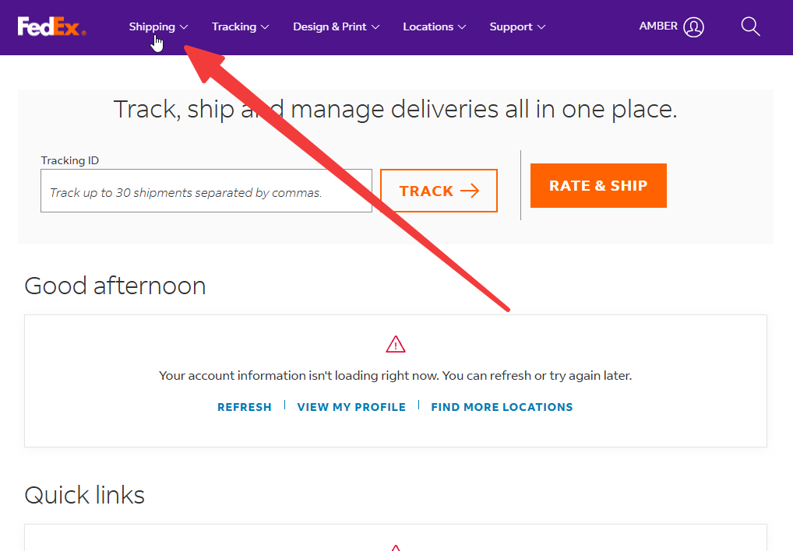
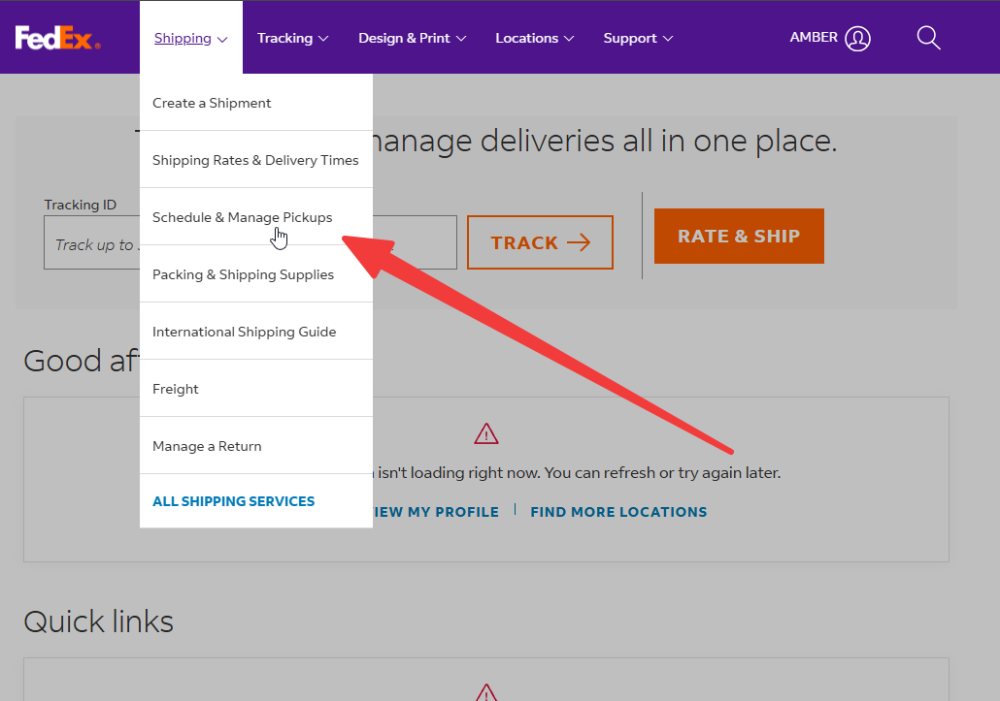
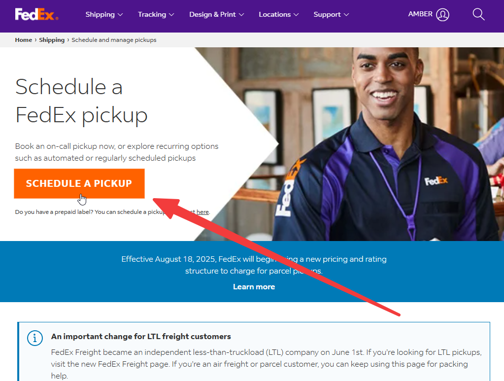
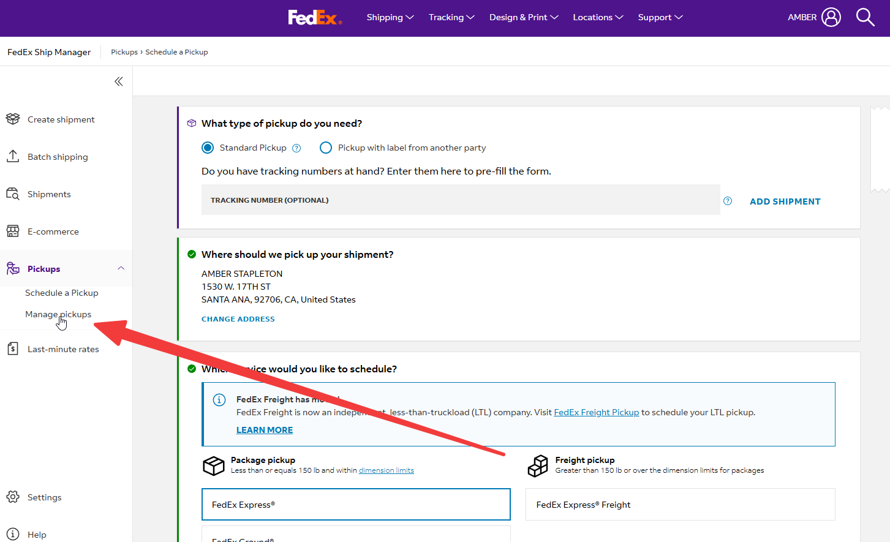
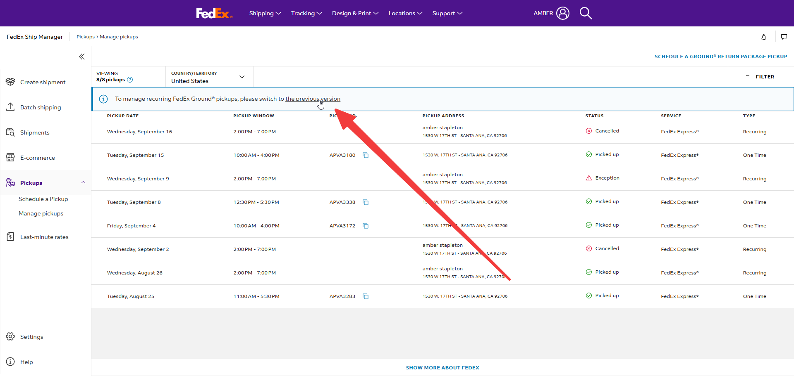
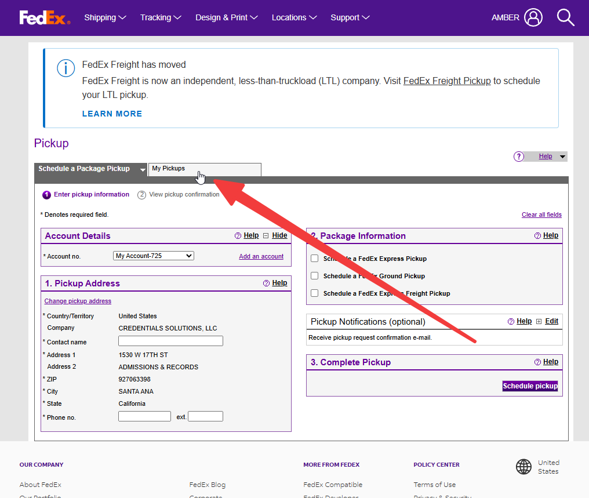
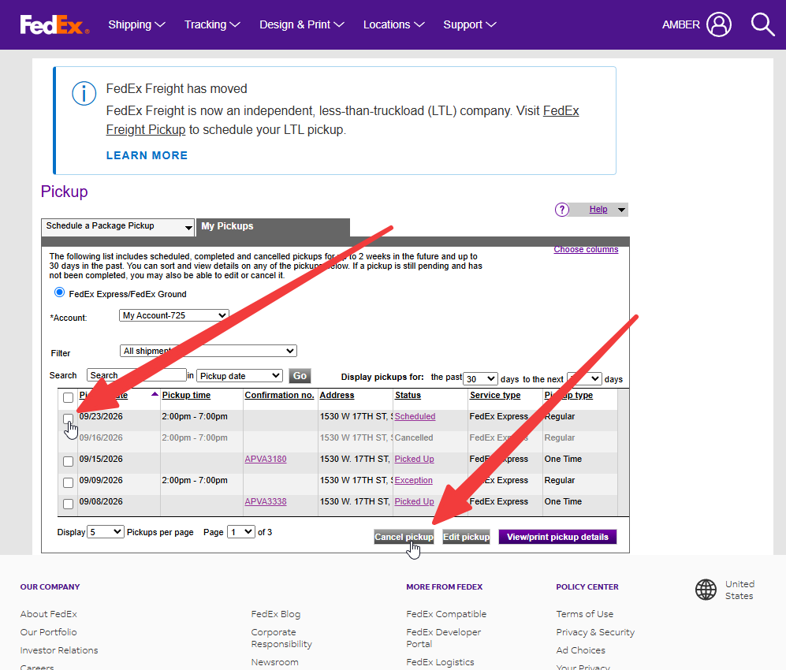

# Cancelling Fedex Pickups

## Steps

1. Go to the [Fedex website](https://www.fedex.com/en-us/home.html) and log in with your credentials.
2. Click on **Shipping**.

    

3. Click on **Schedule & Manage Pickups**.

    

4. Click on **Schedule A Pickup**.

    

5. Click on **Manage Pickups**.

    

6. Click on **...the previous version**.

    

7. Click on **My Pickups**.

    

8. Click on the checkbox for the desired pickup date and click **Cancel Pickup**.

    