# Process Parchment Transcript Orders

## Processing Steps

### Getting Started

1. Log into your [**Parchment Exchange** account](https://exchange.parchment.com/u/auth/login).

2. Click **Resume Printing**.

    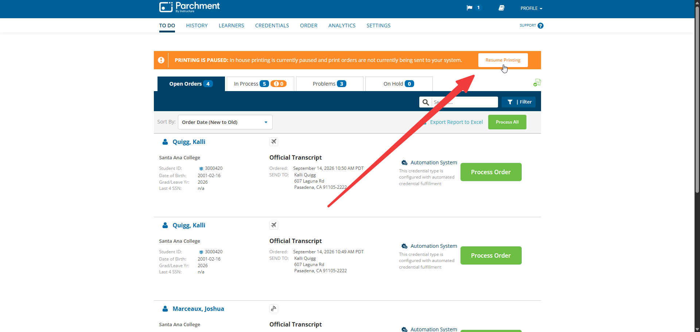

### Open Orders

1. **Open Orders** tab should be opened by default. 

2. Hover mouse over each student and click **More**.

    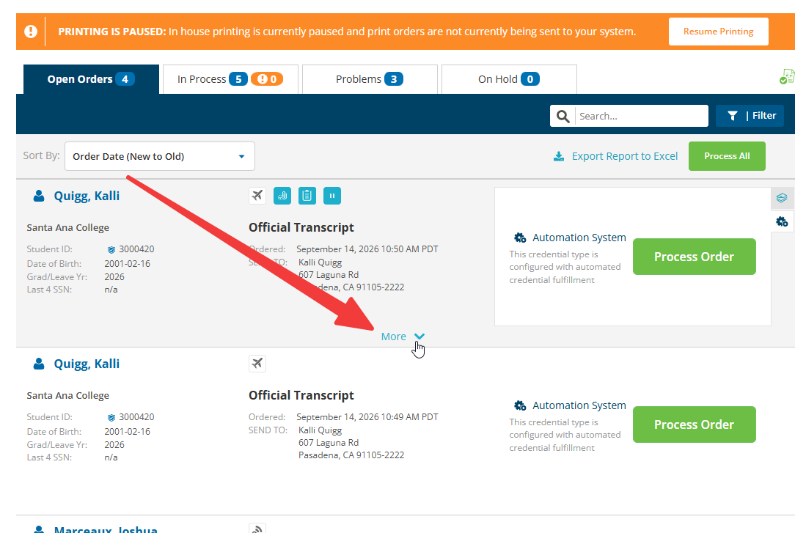

3. Check under **Order Information**.

    - If Order Information states "Yes, I am sending to a UC for transfer purposes."

        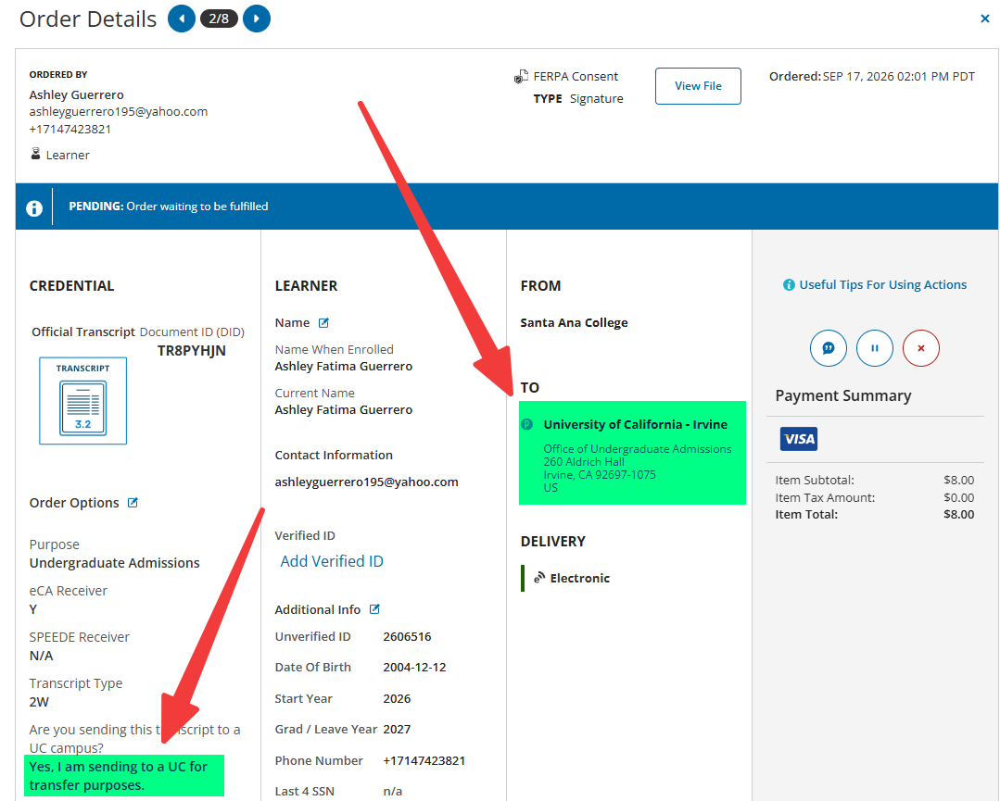
        
        - Navigate to **TRAN** on Colleague and run their transcript. Check and see if there is an IGETC Certification posted towards the end of the transcript.
        - If there is, check on Laserfiche for certification.
        - If certification is missing, reach out to Graduation Office through Teams for the certification.
        - Once certification is available, download from Laserfiche.
        - Click on **Add Attachments** button for the desired student.

            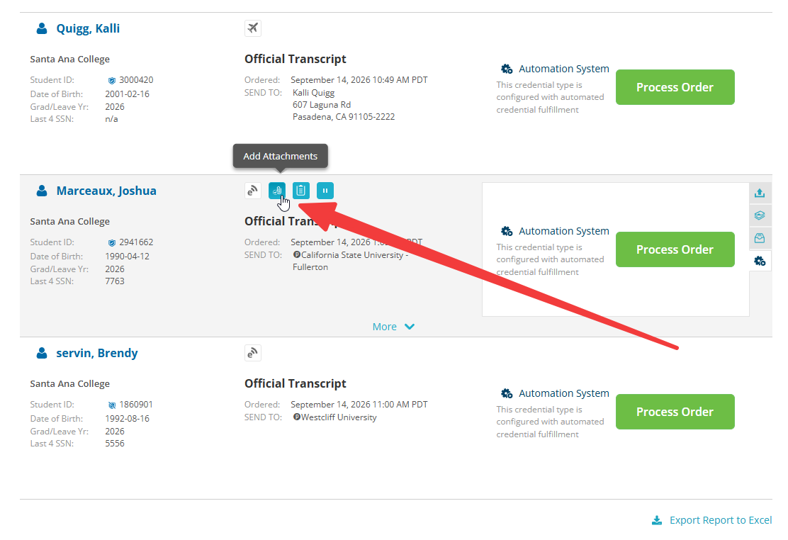

        - Click on **Add Another File**.

            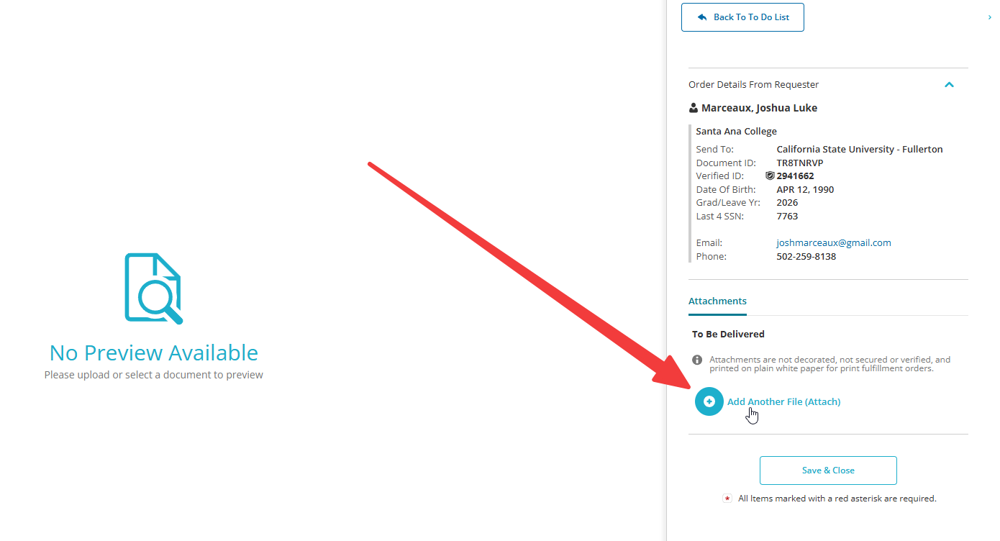

        - Drag and drop the certification into the **Upload New File** area.

            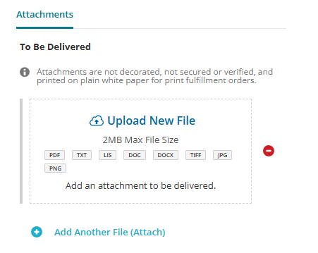

        - Click **Save & Close**.
        - Navigate back to **Open Orders** main page and click **Process Order** for student.

            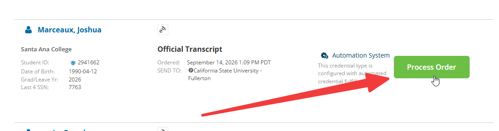

    - If Order Information states "No, I am sending elsewhere or ordering for personal use.", then simply click **Process Order** for student.

### Problems

1. Click on **Problems** tab.

    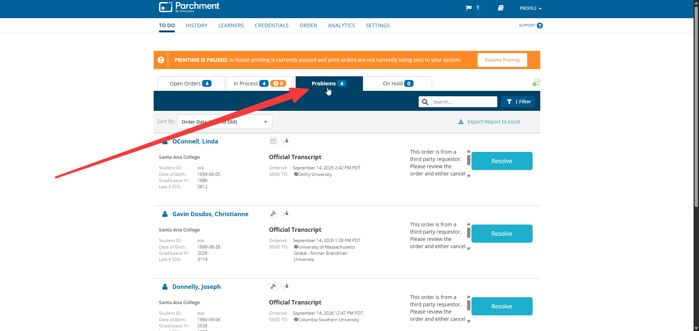

2. Click on each student name to view details.

3. Open **NAE** on Colleague and ensure **Name When Enrolled** matches **NAE** record.

    - If name does not match, click on **Edit** button next to **Name**.

        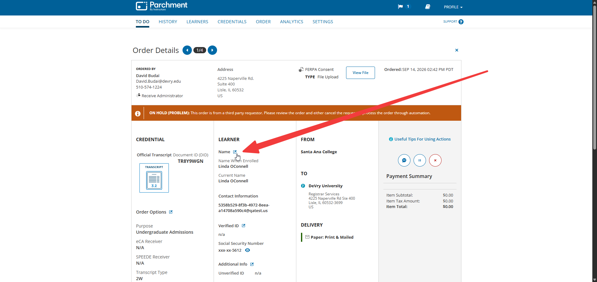

        - Update **Name When Enrolled** to match **NAE**.
        - Click **Save Changes**.
        - Exit student details by clicking **X** button in upper-right hand corner.
        - Click **Resolve**.
        - Click **Process Order**.

    - If we cannot find the student in our records, click **Cancel Order**.
        - Select Cancel Reason.
        - Write comments.
        - Click **Yes, Cancel This Order**.

### Overnight Orders

1. Go to the **History** tab.

    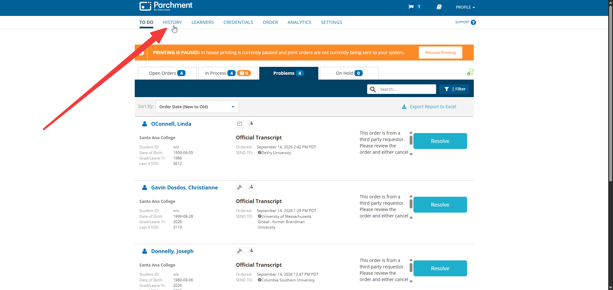

2. Click on **Down Arrow** next to Delivery ID.

    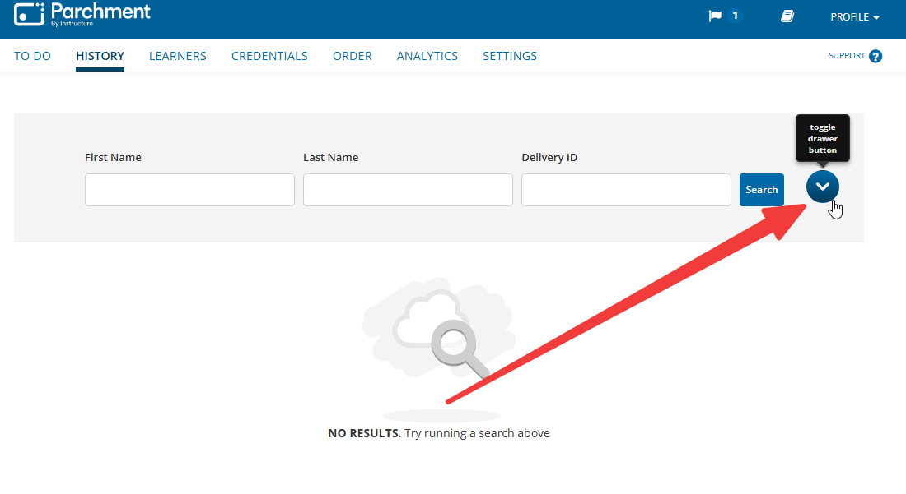

3. Update **Date Range** to **yesterday's date to today's date**.

    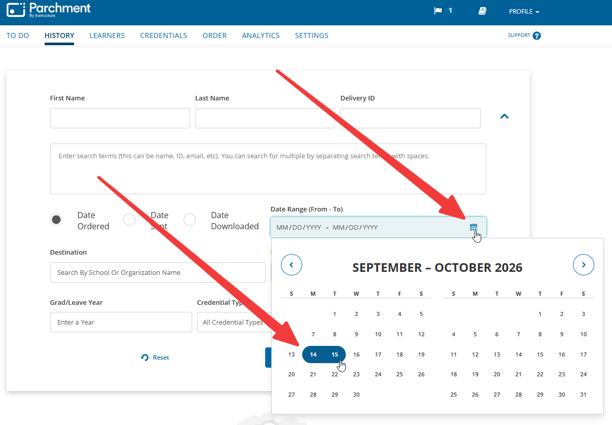

4. Update **Delivery Methods** to `Overnight`.

    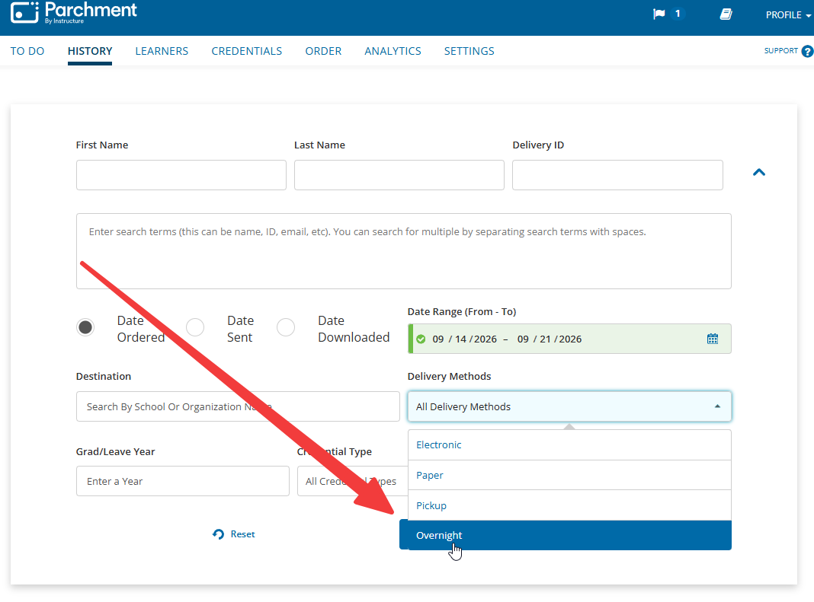

5. Click **Search**.

    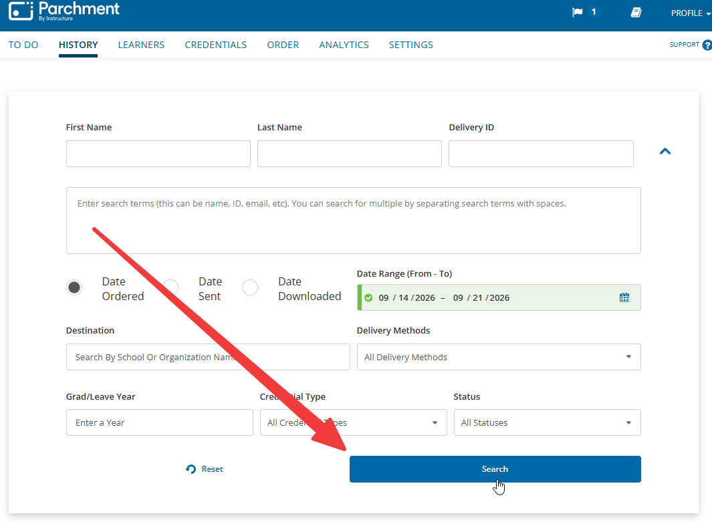

6. Click on each student name.

7. Click **Shipping Label** to print out.

8. Put aside shipping labels for packing step.

### Printing Mail Out Orders

!!! danger "IMPORTANT!!!"
    Make sure there is transcript paper in the printer before next steps!!!

1. Navigate back to **To Do** page.

    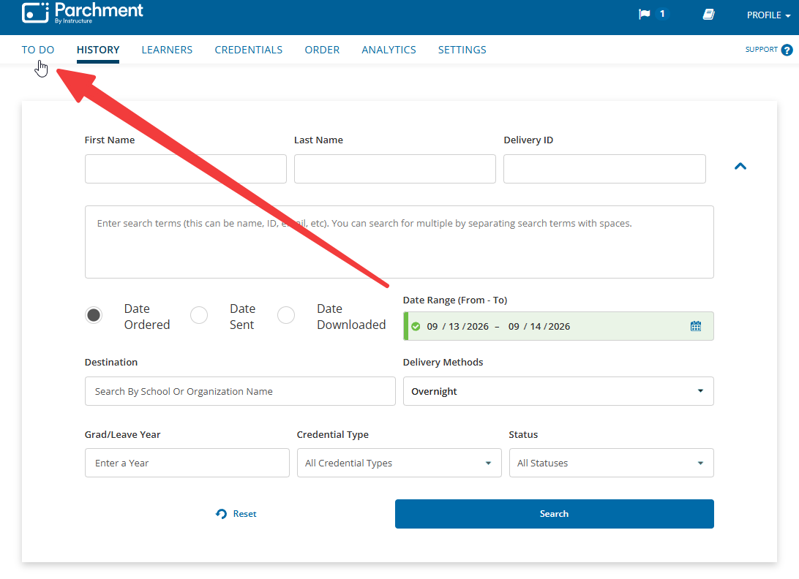

2. Click on **In Process** tab.

3. Make sure that there are no more envelope icons.

4. Go to the **STRQ screen** in Colleague to print paper transcripts to be mailed out.

5. Select today's date for **Request Dates** (start with the right field first).

    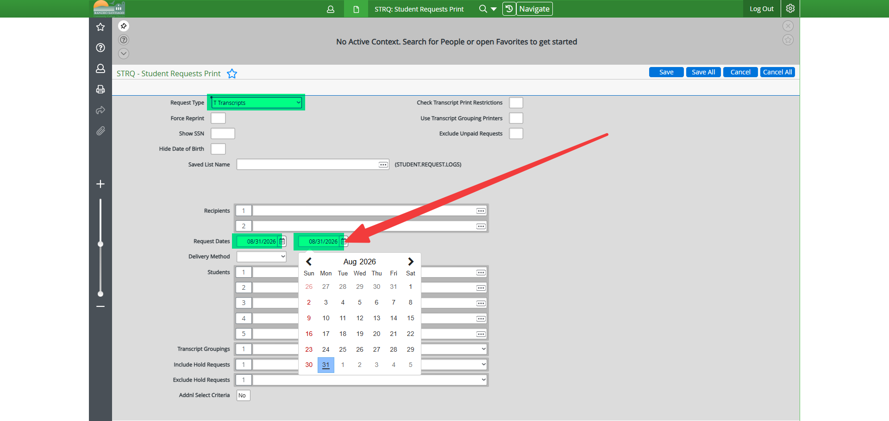

6. Click **Save All** 2x.

7. Fill in the following fields.

    | Field | Details |
    |-|-|
    | Output Device | Enter `P` |
    | Printer | Enter `FormFusion` |
    | Other Options Line 1 | Enter `'prefix=COLL FF_CC OFFICIAL_AMBER SS101000G'`

    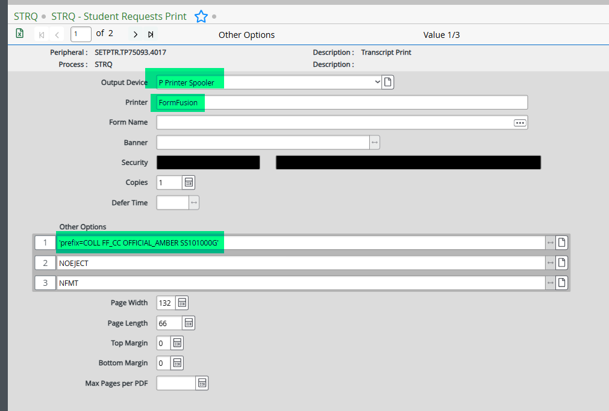

8. Click **Save All**.

9. Fold and pack transcripts and drop off at Mailroom before 12pm.

10. Click **Pause Printing** on Parchment after paper transcripts are printed.

!!! warning "FEDEX"
    Automatic FedEx pick-up days are **Wednesday** — cancel or schedule accordingly.