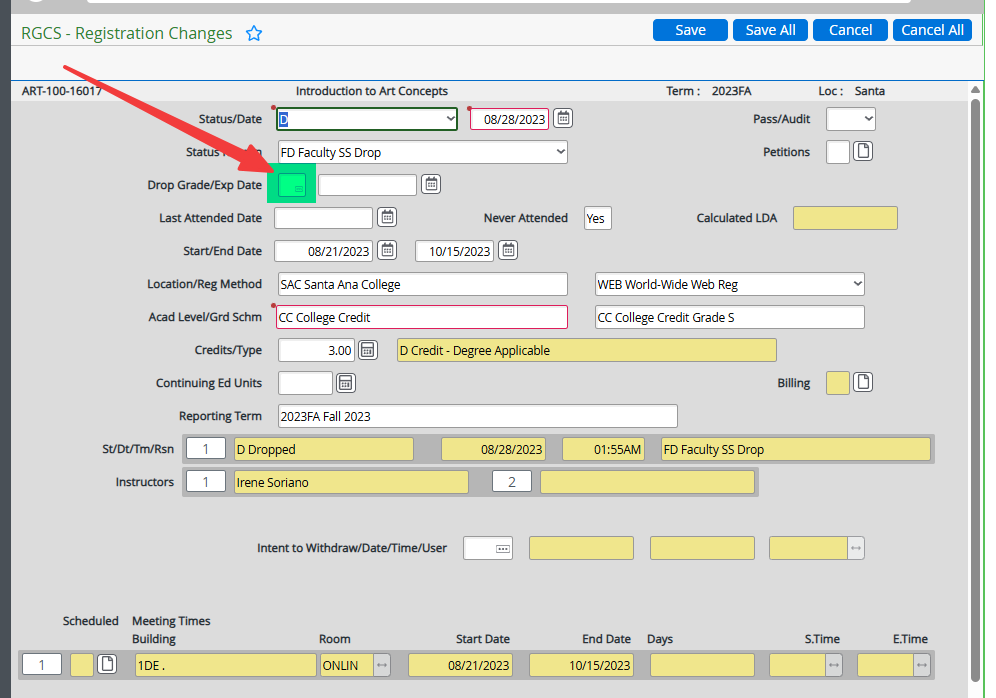
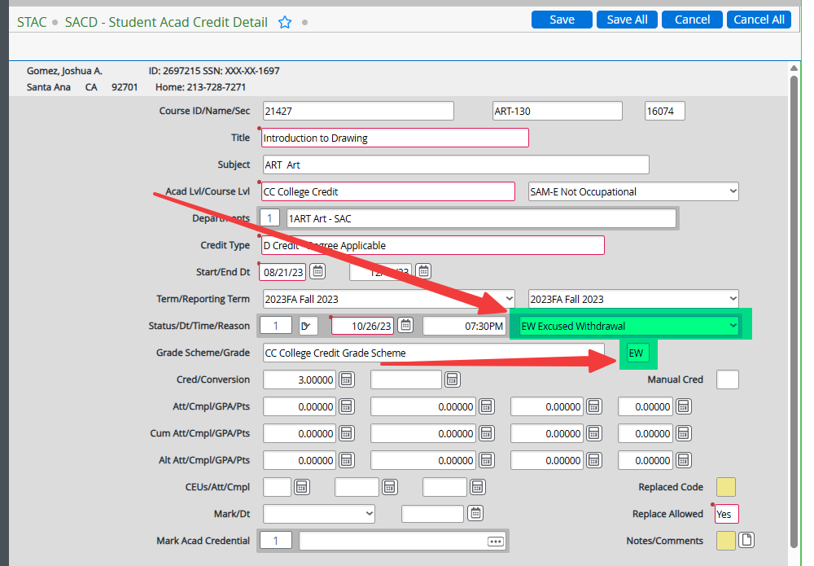
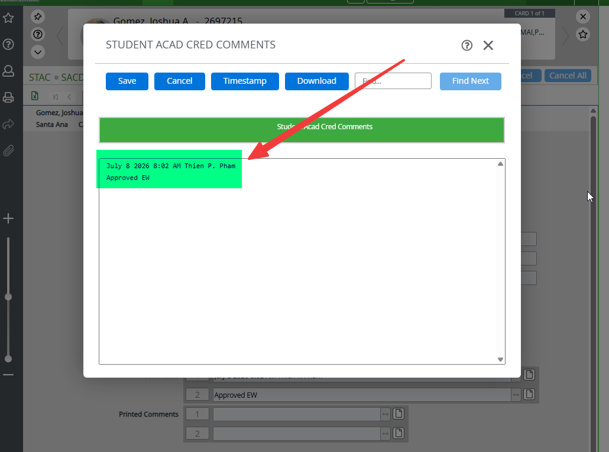
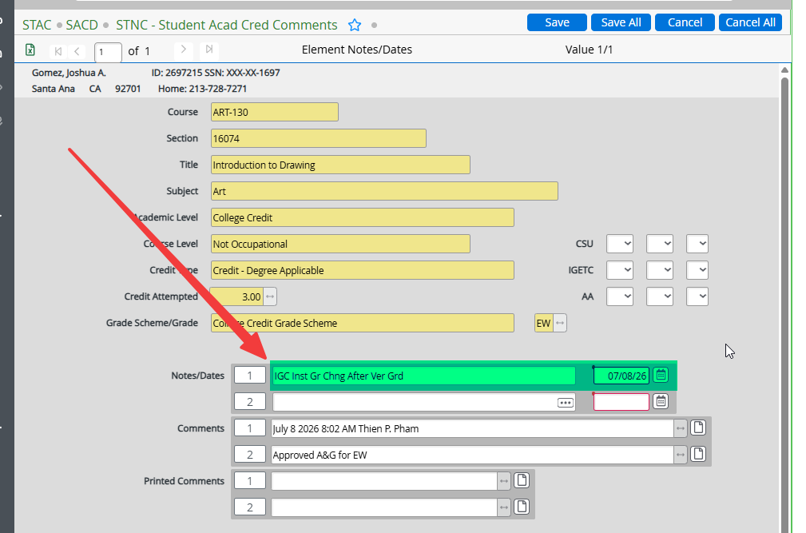

# Excused Withdrawal (EW) Petitions

### Acceptable Reasons for EW

Per Title 5, §55024(e), an EW is acceptable when a student withdraws due to reasons beyond their control, including:

- Illness in the family where the student is the primary caregiver
- An incarcerated student released from custody or involuntarily transferred before the end of the term
- The student is the subject of an immigration action
- Death of an immediate family member
- Chronic or acute illness
- Verifiable accidents
- Natural disasters directly affecting the student

### Tips for Determination

- **Justification** — Make sure the reason falls within the acceptable list.
- **Timeline** — Make sure the justification falls within the term or can understandably affect performance.
    - Example: A life event before the semester could have lingering effects.
- Consider **load** and **modality**.

### Key Rules

- EWs submitted **before** a grade has been posted: processed directly by Admissions & Records.
    - **W's are not considered grades** and **will not** be routed to the faculty review committee.
- EWs submitted **after** a grade has been posted: will be routed to a faculty review committee and then routed to Admissions & Records for final processing.
- EWs are accepted within **one year** of the original grade posting date.
- **CVC students** can submit EW requests but must use PDF versions (no SSO access).

---

### Processing: NO GRADE

Go directly to **STAC**:

1. Find the course that matches the form → drill down.
2. Insert a line.
3. Status: `D`
4. Date:
    - If the petition was submitted before the last day to drop with a W
        - Use the student's **submission date**.
    - If the petition was submitted after the last day to drop with a W
        - Use the last day to drop with a W
    - How to find the last day to drop with a W
        - Navigate to Colleague → **SRGD**.
        - Find the Drop End Date (This is the last day to drop with a W)
5. Reason: `EW`
6. Grade: `EW`
7. Add only a timestamp in Notes/Comments (lower right corner).

!!! note "Screenshot Placeholder"
    EW no-grade entry screenshot is in the original Word manual.

---

### Processing: Class Has a Grade of W

1. Update Student Registration Changes
    - Navigate to **Colleague → RGCS**.
    - Remove W in **RGCS**.
    - Click **Save All**.

    

2. Update Student Academic Credits
    - Navigate to **Colleague → STAC**.
    - Detail into the desired course.
    - Edit the existing drop line:
        - Reason: `EW`
        - Grade: `EW`

    
    
3. Record notes
    - Click on **Notes/Comments**.
    - Click on **Comments**.
        - Timestamp + "Approved EW".
        - Click **Save**.

    

    - If after section end date: include **IGC** in Notes/Dates.

    

    - Click **Save All**.

---

### Processing: Class Has a Letter Grade

1. Note the original grade.
2. Remove grade in **RGCS**.
3. STAC → find the course → drill down.
4. Insert a line:
    - Status: `D`
    - Date: **Before the last day to drop with a W** (find on SRGD)
    - Reason: `EW`
    - Grade: `EW`
    - Notes/Comments: Timestamp only.
    - If after section end date: include **IGC** in Notes/Dates and note the original grade (e.g., *"F to EW"*).

---

### Military Withdrawals

- Process just like Excused Withdrawals.
- Can be processed with final grade without faculty approval as long as we have documentation (military orders) from the student showing that they were summoned during the courses requested for MW. 
- If the end of the course has passed a year, we need approval from the VP of Academic Affairs (send the pdf for an email approval and Laserfiche).

!!! note "Screenshot Placeholder"
    EW letter grade processing screenshots are in the original Word manual.