# Transcript Evaluation for Equivalency (Region 8)

## Processing Steps

### Step 1: Update Institution Attended Information (IASU)

1. Navigate to the **IASU (Institution Attended Summary)** screen.

2. Locate the institution.

    - If the institution already exists, drill into the existing record.
    - If the institution does not exist, enter the institution ID on a new line to add it.
    - Drill into the institution record.

    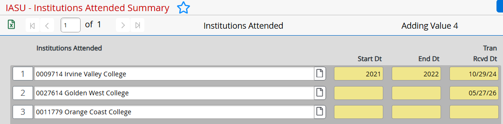

3. Complete the following fields in **INAT (External Institution Attended)**:

    - **Transcript Type**
    - **Date Recorded**
    - **Status**

4. If you need to add another transcript entry for the same institution:

    - Click the **Number 1** button to insert a new line.
    - Set **Transcript Type** to `COL`.
    - Set **Status** to `EEVL` for transcripts being evaluated for total units and equivalency.

    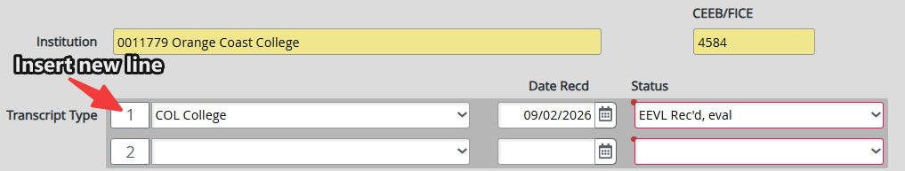

5. When all entries have been completed, click **Save All** and select **Update**.

---

### Step 2: Enter External Transcript Course Information (EXTS)

1. Navigate to the **EXTS (External Transcript Summary)** screen.

2. Enter the Student ID in the **Person Lookup** field.

3. Select the appropriate institution from the list.

4. Drill into the transcript **Detail** record.

    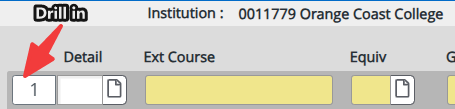

5. Complete all required fields for each transfer course.

    | Field | Details |
    |---|---|
    | External Course Code | Rename the transfer course using the appropriate equivalency code, such as `TCEQ-1ANTH A100` |
    | End Date | Summer: `07/31/YY`<br>Fall: `12/31/YY`<br>Spring/Intersession: `05/31/YY` |
    | Title | Should auto-populate |
    | Credits | Should auto-populate |
    | Grade Scheme | `CC` |
    | Grade | Enter the grade listed on the transcript |
    | Term | Enter the term in which the course was taken, such as `2025SP` |

    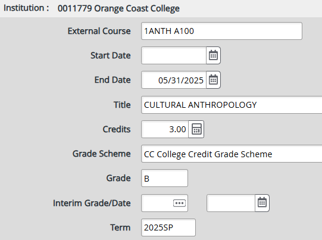

6. When all course details have been entered:

    - Click **Save**.
    - Select **Update**.

7. If there are additional courses, repeat the course-entry steps for each course.

8. When all courses have been entered, click **Save All**.

9. Review the **Equiv** field.

    - If **Equiv** displays **No**, review the entries for accuracy.

        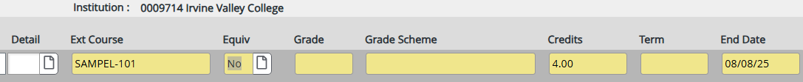

    !!! warning "Equiv = No"
        If the **Equiv** field displays **No**, verify the following entries:

        - External Course Code
        - End Date
        - Grade Scheme
        - Grade
        - Term

        The course information must match the equivalency table for the equivalency to be applied.

    - Once the entries are correct, **Equiv** should display **Yes**.

        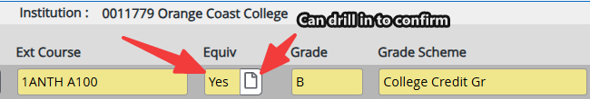

    - Drill into the equivalency record to confirm that the approved course equivalency appears correctly.

        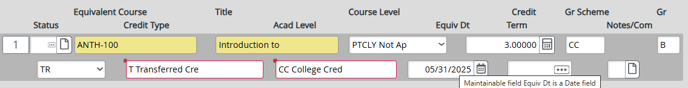

---

### Step 3: Update Student Academic Credits (STAC)

1. Navigate to the **STAC (Student Academic Credits)** screen.

2. Drill into the course name.

3. Select **SACD (Student Acad Credit Detail)**.

    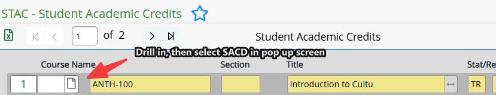

4. Update the course information.

    - Change the **Course Code** to the equivalent course code listed in the equivalency table.
    - Include a leading `1` in the course code, as required.
    - Include the name of the previous school in the course title.
    - Place an equals sign (`=`) at the beginning of the course title.
    - Enter the equivalent course name after the equals sign.
    - Add the school name at the end of the title.

    **Example course title:**

    ```text
    = Introduction to Anthropology - Coastline College
    ```

    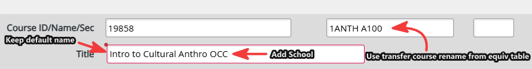

5. When all updates have been completed, click **Save All**.

6. Verify that the updated course appears in **STAC** with the previous school's information displayed on the course line.

    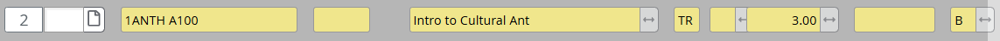

---

### Step 4: Review the Student Audit (PSPR)

1. Navigate to the **PSPR (Proposed Student Program)** screen.

2. Run **PSPR** to review how the course equivalency appears in the student's audit.

3. Locate the transferred course under the student's **Local Plan**.

    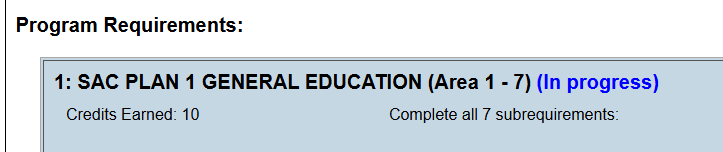

4. Review the audit result and confirm that the transferred course is satisfying the appropriate requirement.

    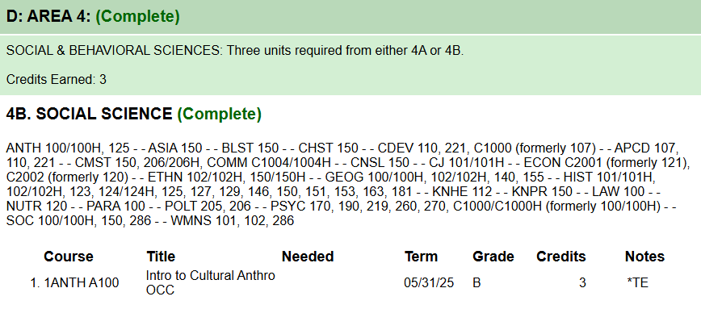

!!! tip "Final Verification"
    Before completing the evaluation, confirm that:

    - The external course information was entered accurately.
    - The **Equiv** field displays **Yes**.
    - The equivalent course code and title appear correctly in **STAC**.
    - The previous school's name appears in the course title.
    - The transferred course appears under the appropriate **Local Plan** requirement in **PSPR**.