# Transcript Evaluation — Transfer Units

## Overview
This section provides guidelines and procedures for evaluating transfer units from other institutions. It covers the steps for researching and verifying the accreditation of the sending institution, assessing the transferability of courses, and documenting the evaluated units before entry into the student's academic record.

## Student Verification

Even though the intake team initially reviews and matches students with their records, it is important to still reverify that we have the correct student tied to the academic record before proceeding with the evaluation.

## Institution Verification

Before evaluating transfer units, we want to make sure that we are using the institution with the CEEB code attached to it.

1. Navigate to IASU on Colleague for the desired student.
2. Detail into the desired school.

    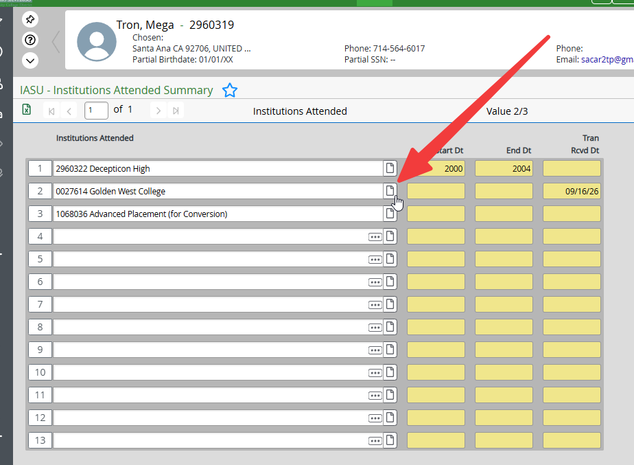

3. Ensure that the institution has a CEEB code associated with it.

    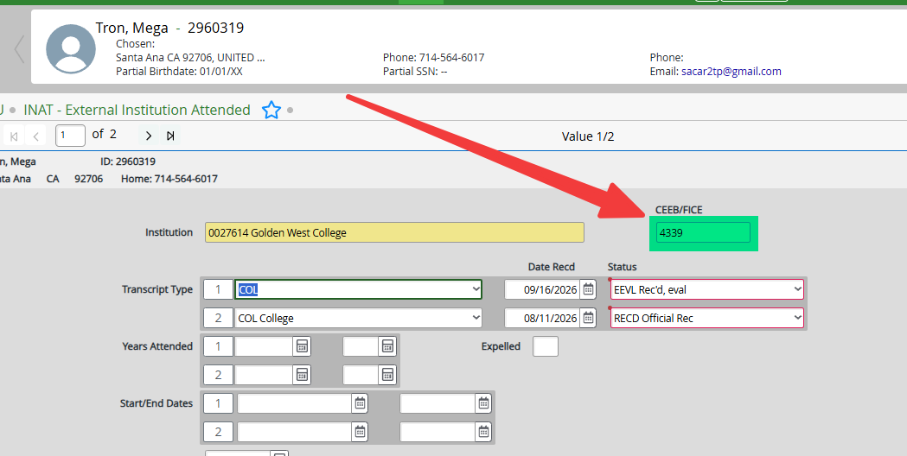

4. If the institution does not have a CEEB code, check the Master CEEB Code list to find the appropriate school ID and create a new line on IASU with the correct details.

## Accreditation

Ensure that the institution is recognized by a legitimate a regional accrediting body before proceeding with the evaluation.

| Accreditation | Accrediting Agency |
|--------------|-------------------|
| MSCHE | Middle States Commission on Higher Education |
| NCA-HLC | Higher Learning Commission (formerly North Central Association of Schools and Colleges) |
| NWCCU | Northwest Commission on Colleges and Universities |
| NEASC-CIHE | New England Association of Schools and Colleges, Commission on Institutions of Higher Education (New England Commission of Higher Education) |
| SACS | Southern Association of Colleges and Schools, Commission on Colleges |
| WASC-ACCJC | Western Association of Schools and Colleges, Accrediting Commission for Community and Junior Colleges |
| WASC-ACACS | Western Association of Schools and Colleges, Accrediting Commission for Senior Colleges and Universities |

### Checking Accreditation

Accreditation information can be found through the [Transfer Evaluation System](https://tes.collegesource.com/TES_login.aspx).

1. Log into TES.

2. Click Search.

    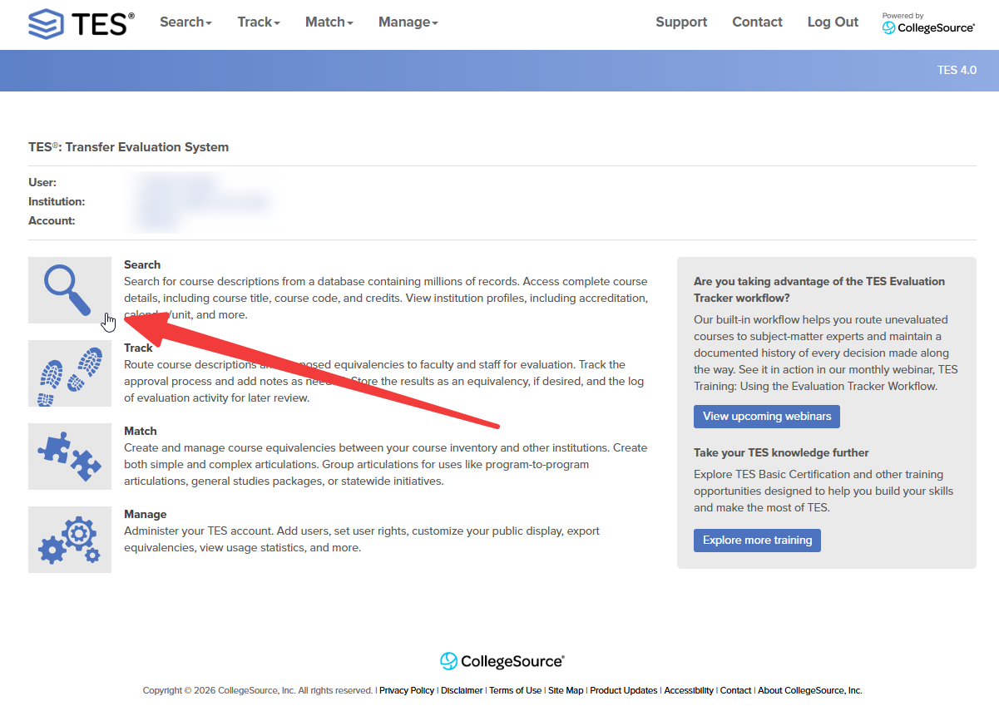

3. Enter the institution name in the search field and click **Search**.

    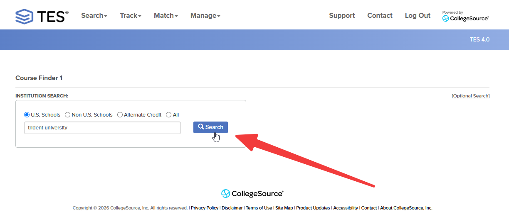

4. Click on the blue button next to the desired institution to view its details.

    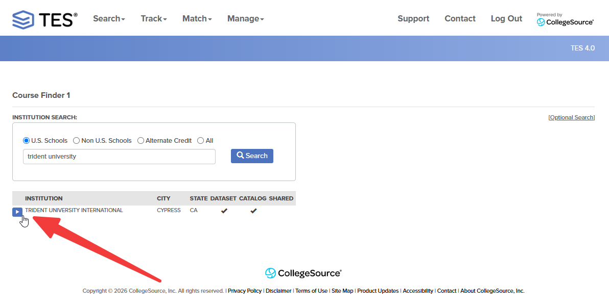

5. Click on the "View institution profile" icon.

    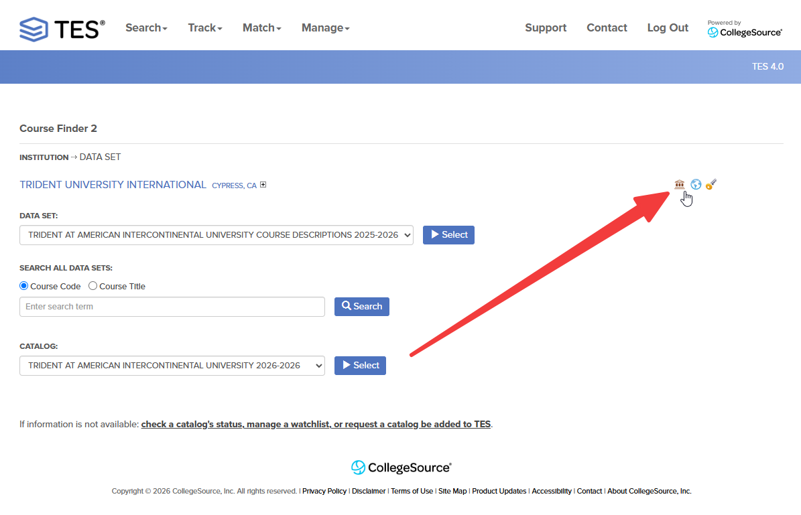

6. Review the accreditation information listed on the institution profile to ensure it is recognized by a legitimate regional accrediting body.

    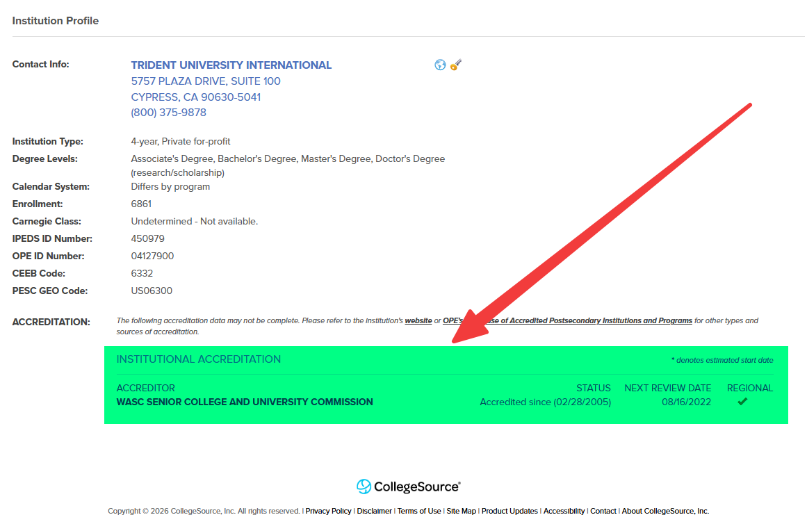

7. If the institution is not recognized by a legitimate regional accrediting body, **DO NOT** proceed with the evaluation.

!!! note "Alternative Accreditation Checking Option"
    If the accreditation information is not available through TES, you can alternatively check the institution's official website or visit the Database of Accredited Postsecondary Institutions and Programs (DAPIP) [here](https://ope.ed.gov/dapip/#/home) to verify its accreditation status.

## Calendar System

The calendar system of the institution should be verified to accurately evaluate transfer units.

### Checking the Calendar System

1. Follow the same steps as [verifying accreditation](#checking-accreditation) to access the institution profile in TES.

2. Look for the calendar system information on the institution profile.

    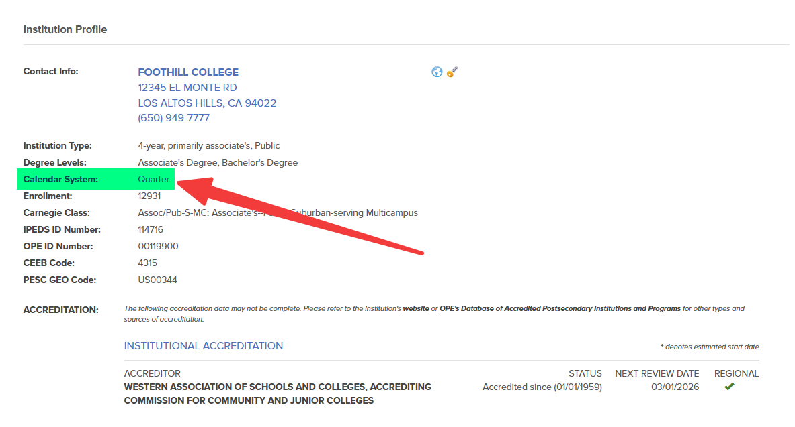

3. If the calendar system is not listed or unclear, you can check the institution's transcript key as well.

    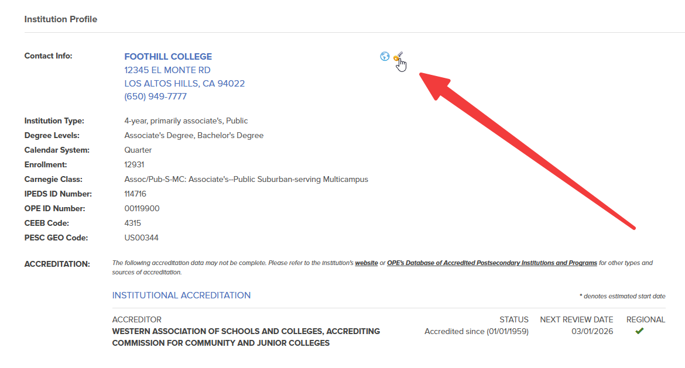

4. Take note of the calendar system used by the institution to ensure accurate evaluation of transfer units (e.g., semester, quarter, trimester).

## Course Numbering System

The course numbering system of the institution should be verified to accurately evaluate transfer units.

### Checking the Course Numbering System

1. Follow the same steps as [verifying accreditation](#checking-accreditation) to access the institution profile in TES.

2. Click on the institution's transcript key.

    

3. Take note of the course numbering system used by the institution to ensure accurate evaluation of transfer units (e.g., 100-level, 200-level, 300-level).

    !!! note "Important"
        Each school may have a different course numbering system, so it is important to verify it for each institution individually.

        - E.g., Long Beach City College courses from 1-99 are considered transferable and anything higher is not.
        - E.g., Orange Coast College courses from 100 and up are considered transferable and anything lower is not.

## Determining Which Courses To Ignore

### Non-Degree Applicable Courses

The degree applicability of courses from the institution should be verified to accurately evaluate transfer units.

#### Checking Degree Applicability

1. From the Course Finder 2 page, click on applicable academic year of the catalog you want to review.

    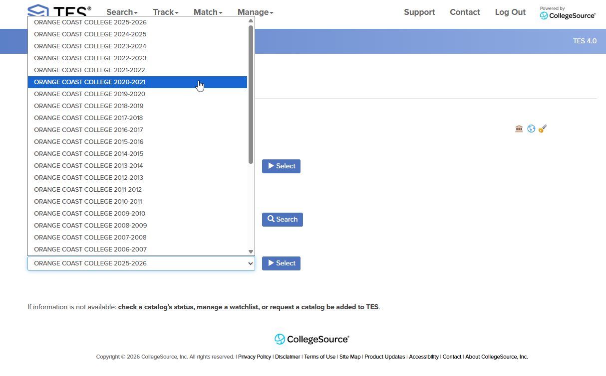

2. Click Select to view the catalog.

    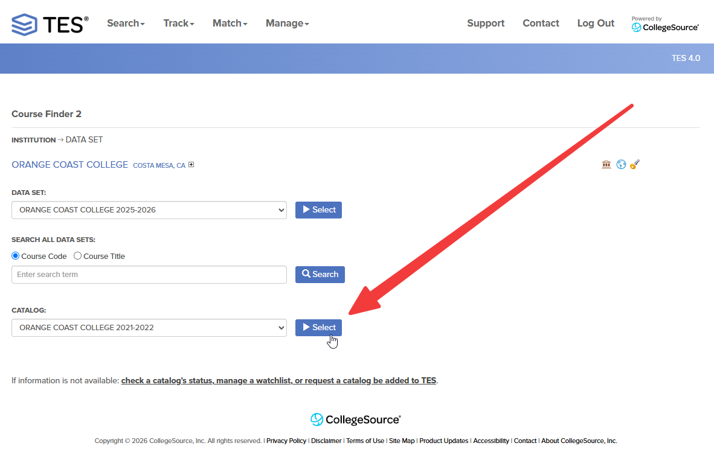

3. Navigate through the catalog to the course descriptions.

    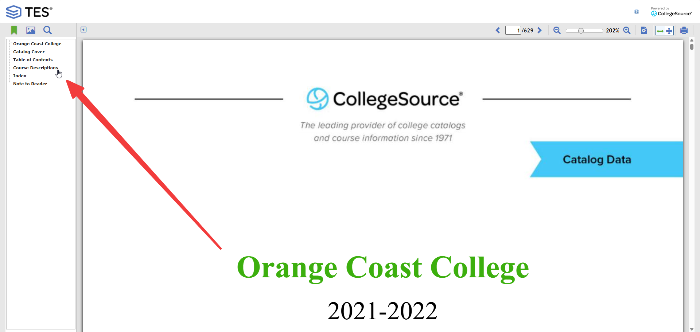

4. Compare between course descriptions to see what counts as degree applicable or not. This will require your judgment call based on the information provided in the catalog.

    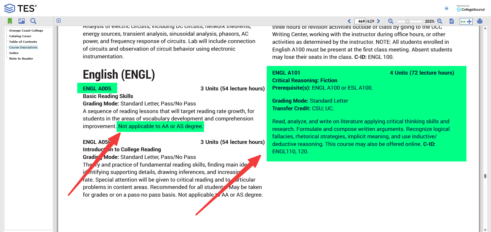

    !!! tip "Tip"
        Search for classic non-degree applicable courses like pre-algebra, English as a Second Language (ESL), etc. to quickly identify courses that may not count towards degree requirements and then compare with the courses you are checking from the student's transcript.

4. Line out any courses on the student's transcript that are identified as non-degree applicable based on the catalog review.

5. **DO NOT** count any units for non-degree applicable courses towards the student's transfer credit.

### In Progress Courses

The evaluation of in progress courses from the institution should be verified to accurately assess transfer units.

#### Checking for In Progress Courses

1. Click on the institution's transcript key.

    

2. Review the transcript key to identify how each school indicates in progress courses.

    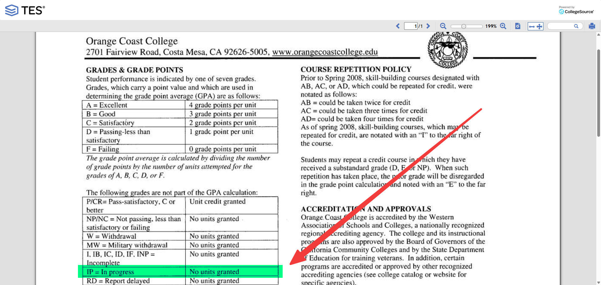

3. Line out any in progress courses on the student's transcript that are not eligible for credit based on the catalog review.

4. **DO NOT** count any units for in progress courses towards the student's transfer credit until the courses are completed and grades are posted.

### Repeated Courses

The evaluation of repeated courses from the institution should be verified to accurately assess transfer units.

#### Checking for Repeated Courses

1. Click on the institution's transcript key.

    

2. Review the transcript key to identify how each school indicates repeated courses.

    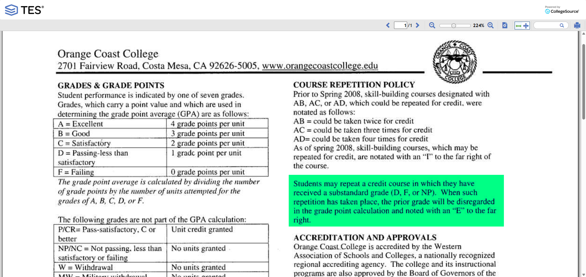

3. Line out any repeated courses on the student's transcript that are not eligible for credit based on the catalog review.

4. Only count these units in the UNITS ATMPT column on the transcript.