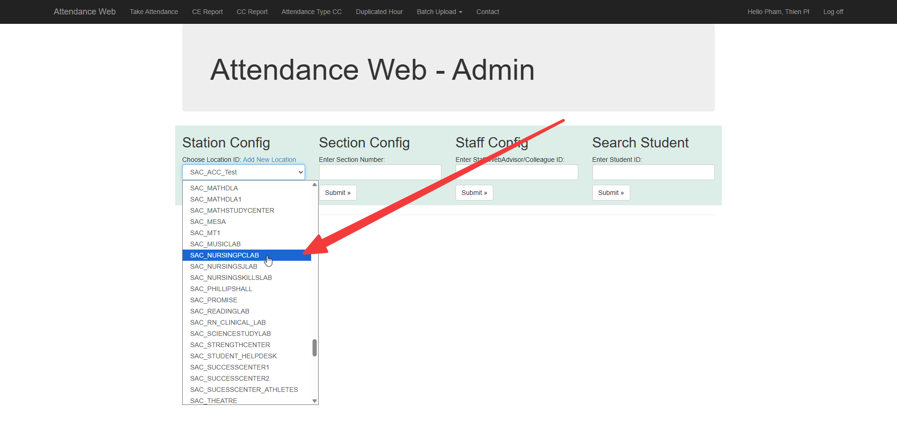
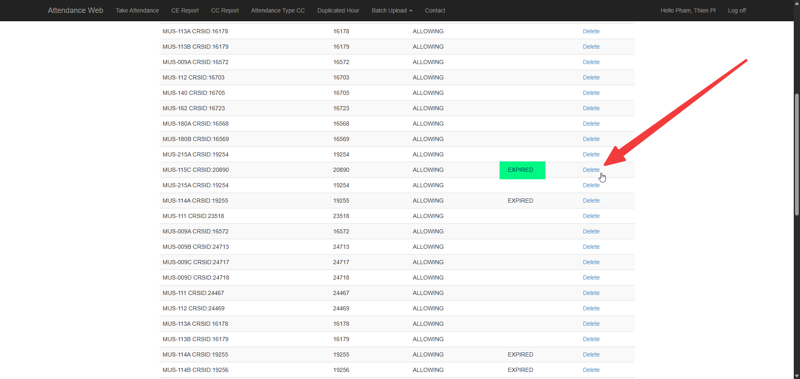
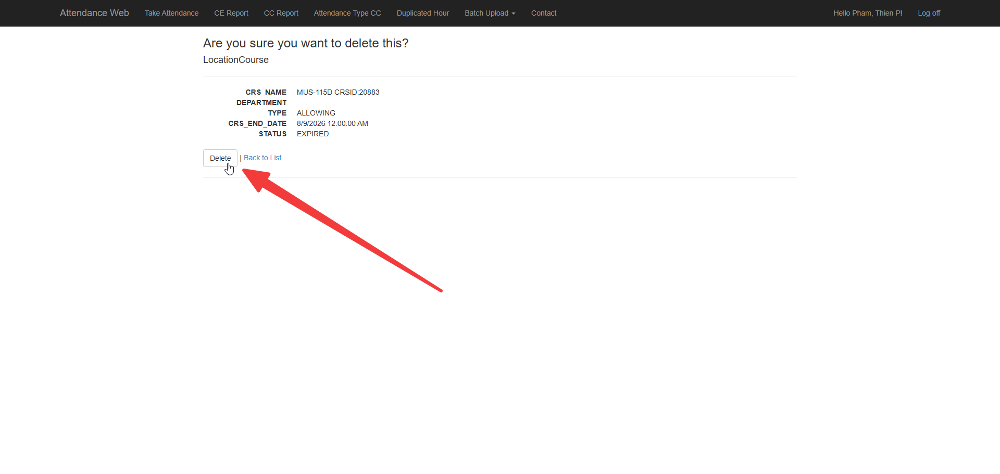
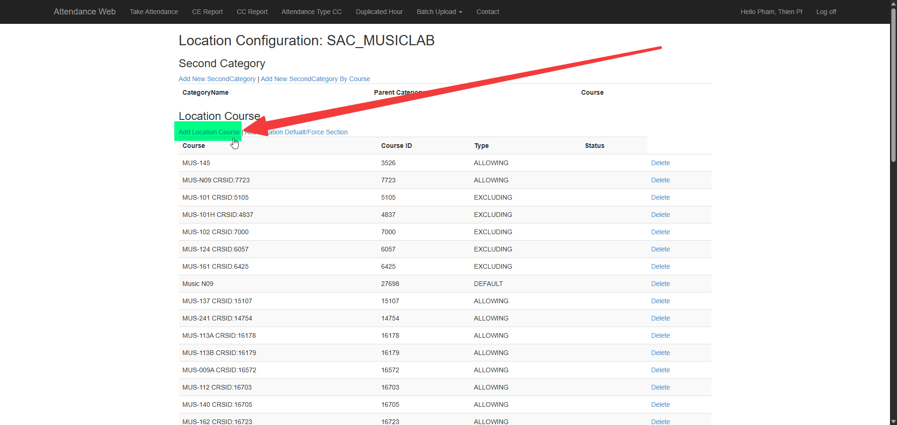
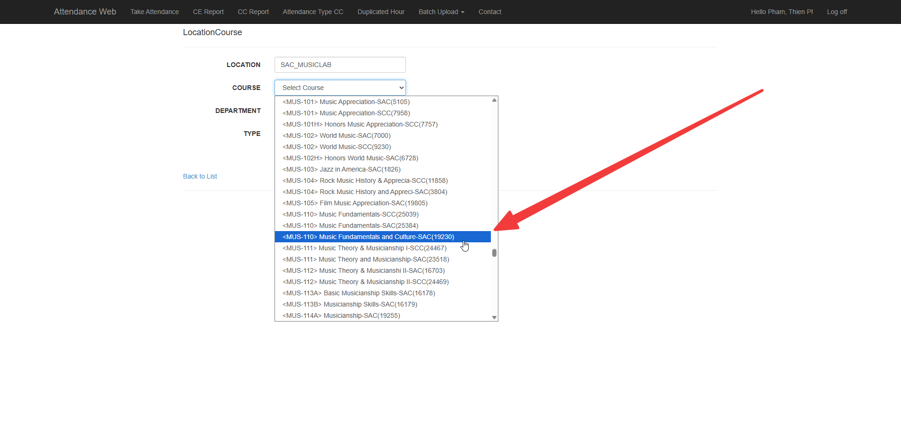
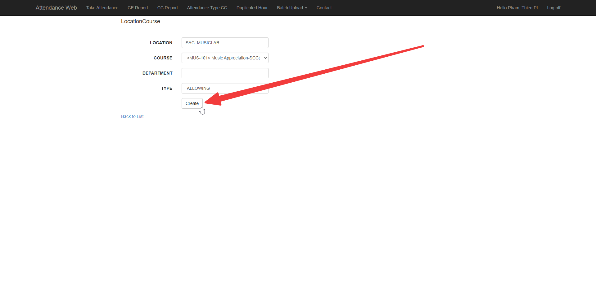

# Attendance Web

## Station Config

**Purpose:** Update login station configurations for Attendance Web.

1. Navigate to [Attendance Web](https://attendance.rsccd.edu/AttendanceWeb/).

2. Click on **Choose Location ID**.

3. Click on the appropriate lab and then click **Submit**.

    

4. Delete any expired configurations.

    

    

5. Click on **Add Location Course**.

    

6. Select the course. (This is by Course ID, not by Section)

    

7. Click **Create**.

    

8. Repeat for any additional courses.